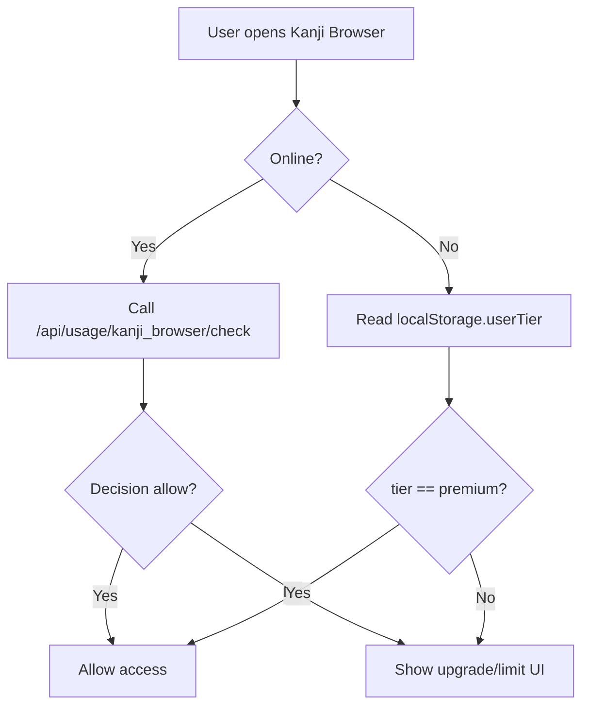

# Payment + Entitlements Onboarding Guide

This guide is a fast-start reference for developers who need to understand and change access control, quotas, and billing-related feature gating in Moshimoshi.

## What This System Controls

- Which features are available to guest, free, and premium users.
- Daily/monthly usage limits for quota-based features.
- Page-level gating for premium-only routes.
- API-based usage checks and limits.
- Stripe plan mapping to internal plans.

## Source of Truth

All entitlements come from:

- `config/features.v1.json`

Key rules:
- `-1` = unlimited
- `0` = blocked (premium-only)
- `1+` = quota (daily or monthly)

When you change `config/features.v1.json`, you MUST regenerate types and policy:

```bash
npm run gen:entitlements
```

This updates:
- `src/types/FeatureId.ts`
- `src/lib/entitlements/policy.ts`
- `src/lib/features/registry.ts`

## Key Files and Responsibilities

- `config/features.v1.json`
  - Plans, features, limits, Stripe mapping.
- `src/types/FeatureId.ts`
  - Type-safe feature IDs.
- `src/lib/entitlements/policy.ts`
  - Runtime plan limits and metadata.
- `src/lib/features/registry.ts`
  - Feature metadata for UI and logic.
- `src/components/review-engine/EntitlementGate.tsx`
  - Page-level gating (premium-only pages).
- `src/hooks/useFeature.ts`
  - Action-level checks (quota gating and tracking).
- `src/app/[locale]/pricing/page.tsx`
  - Pricing page, uses `from=<featureId>` in redirects.

## Access Control Patterns

### 1) Page-Level Gating (Premium-Only)

Use `EntitlementGate` when a page should be fully blocked for free users.

```tsx
import { EntitlementGate } from '@/components/review-engine/EntitlementGate'

export default function ComicsPage() {
  return (
    <EntitlementGate featureId="comics">
      <ComicsContent />
    </EntitlementGate>
  )
}
```

Expected behavior:
- Guest users see a login modal.
- Free users are redirected to `/<locale>/pricing?from=<featureId>`.
- Premium users proceed.

Important: wrap loading/error states inside `EntitlementGate`, otherwise free users can still load content before the gate runs.

### 2) Action-Level Gating (Quota)

Use `useFeature` for actions where users can browse but should be limited when they click or submit.

```tsx
const { checkAndTrack, remaining } = useFeature('grammar_explanations')

const handleExplain = async () => {
  const allowed = await checkAndTrack({ showUI: true })
  if (!allowed) return
  // continue action
}
```

Use `checkOnly` for non-tracking checks when you do not want to consume quota yet.

## Pricing Redirects (`from` param)

Premium-only pages should send free users to pricing with the `from` query param:

- Example: `/en/pricing?from=comics`

The pricing page uses a gated feature list to prevent back-looping. If you add a new premium-only feature, update:

- `src/app/[locale]/pricing/page.tsx`
  - Add the feature ID to `gatedFeatures`.

## Current Premium-Only Routes (gated via EntitlementGate)

- `/en/flashcards` (feature: `flashcards`)
- `/en/tools/textbook-vocabulary` (feature: `textbook_vocabulary`)
- `/en/comics` (feature: `comics`)
- `/en/comics/:episodeId` (feature: `comics`)
- `/en/kanji-connection` (feature: `kanji_connection`)
- `/en/kanji-connection/families` (feature: `kanji_connection`)
- `/en/kanji-connection/radicals` (feature: `kanji_connection`)
- `/en/kanji-connection/visual-layout` (feature: `kanji_connection`)
- `/en/library` (feature: `books`)
- `/en/library/:id` (feature: `books`)

If you introduce new premium-only routes, add EntitlementGate and update the pricing `gatedFeatures` list.

## Usage Checks API

Every feature can be checked via:

```
GET /api/usage/:featureId/check
```

Response includes:
- `plan`, `limit`, `allow`, `remaining`, `currentUsage`, `bucketKey`, `reason`

This endpoint is used by UI gating, the entitlement hooks, and E2E tests.

## Testing (Required Before Release)

### Playwright: Entitlements Suite

Run the full entitlement test suite locally:

```bash
E2E_BYPASS_RECAPTCHA=true npm run dev -- --port 3001
```

In a second terminal:

```bash
E2E_BASE_URL=http://localhost:3001 \
E2E_FREE_EMAIL=dan@beano.com E2E_FREE_PASSWORD='Beano200419!' \
E2E_PREMIUM_EMAIL=charles@beano.com E2E_PREMIUM_PASSWORD='Beano200419!' \
E2E_SERVICE_ACCOUNT_PATH=/home/beano/DevProjects/NextJs/moshimoshi/moshimoshi-service-account.json \
PLAYWRIGHT_USE_SYSTEM=0 \
npx playwright test \
  e2e/entitlements.spec.ts \
  e2e/entitlements-usage.spec.ts \
  e2e/entitlements-exhaustion.spec.ts \
  --project=chromium
```

Notes:
- `entitlements.spec.ts` validates gating (free vs premium).
- `entitlements-usage.spec.ts` validates `/api/usage/:feature/check` across all features.
- `entitlements-exhaustion.spec.ts` forces usage to limit via service account and ensures block.

If auth sessions are stale, re-run setup:

```bash
E2E_FORCE_REAUTH=true npx playwright test --project=setup
```

### Common Test Failures

- `ECONNREFUSED`: dev server not running on the expected port.
- `Sign in failed with status 429`: too many auth attempts. Use storageState and avoid repeated logins.
- `Auth session missing`: run setup or clear `e2e/.auth/*.json` and re-auth.
- `ChunkLoadError`: stale Next.js bundles; restart dev server and clear `.next`.

## Adding or Changing a Feature

1) Update `config/features.v1.json`:
   - Add feature ID, metadata, limitType.
   - Set limits per plan.
2) Run:
   ```bash
   npm run gen:entitlements
   ```
3) Update gating pattern:
   - Page-level gate: add `EntitlementGate` around page content.
   - Action-level gate: use `useFeature` where the action happens.
4) Update pricing gating list if it is premium-only.
5) Update tests:
   - Add or adjust cases in `e2e/entitlements.spec.ts` if the route is gated.
   - Entitlement usage tests already cover all features defined in config.

## Reference Docs

- `01_PRODUCTION_DOCS/2-Payment-Monetization/ENTITLEMENTGATE.md`
- `01_PRODUCTION_DOCS/2-Payment-Monetization/FEATURE_QUOTA_IMPLEMENTATION_GUIDE.md`
- `01_PRODUCTION_DOCS/2-Payment-Monetization/STRIPE_STRIPE_INTEGRATION_OVERVIEW.md`
- `01_PRODUCTION_DOCS/2-Payment-Monetization/STRIPE_ARCHITECTURE_EXPERT_REPORT.md`


## Offline Access Policy (Premium Grace)

Online enforcement is fail-closed. Offline, we allow a **best-effort premium grace** using cached tier:

- `useSubscription` writes `localStorage.userTier` whenever subscription data is fetched.
- When offline, Kanji Browser allows access **only** if `userTier === 'premium'`.
- Free users remain blocked offline.
- If a premium subscription is canceled while offline, access may continue until the next online refresh.

This is a deliberate UX trade-off and should not be treated as a billing source of truth.


