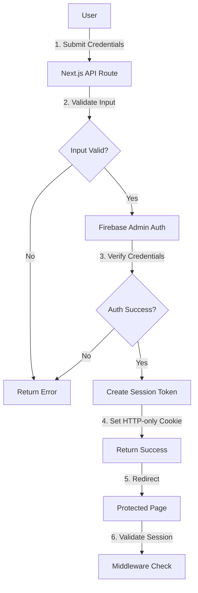

# Authentication Flows

## Overview

This document details all authentication flows in Moshimoshi, including email/password, magic link, and OAuth. All flows are implemented server-side using Next.js API routes and Firebase Admin SDK.

## Flow Diagrams

### High-Level Authentication Flow



## 1. Email/Password Authentication

### Sign Up Flow

#### API Endpoint: `POST /api/auth/signup`

```typescript
// Request Body
{
  email: string;
  password: string;
  displayName?: string;
  referralCode?: string;
}

// Response (Success)
{
  success: true;
  user: {
    uid: string;
    email: string;
    tier: 'free';
  };
  requiresVerification: boolean;
}

// Response (Error)
{
  error: {
    code: 'AUTH_EMAIL_EXISTS' | 'AUTH_WEAK_PASSWORD' | 'AUTH_INVALID_EMAIL';
    message: string;
  }
}
```

#### Implementation Flow

```typescript
async function signUp(req: NextApiRequest, res: NextApiResponse) {
  // 1. Rate limiting
  const rateLimitOk = await checkRateLimit(req);
  if (!rateLimitOk) {
    return res.status(429).json({ 
      error: { code: 'RATE_LIMITED', message: 'Too many attempts' }
    });
  }

  // 2. Validate input
  const validation = SignUpSchema.safeParse(req.body);
  if (!validation.success) {
    return res.status(400).json({ 
      error: { code: 'INVALID_INPUT', message: validation.error }
    });
  }

  const { email, password, displayName } = validation.data;

  try {
    // 3. Create Firebase user
    const userRecord = await admin.auth().createUser({
      email,
      password,
      displayName,
      emailVerified: false
    });

    // 4. Create Firestore profile
    const profile: UserProfile = {
      uid: userRecord.uid,
      email,
      displayName,
      tier: 'free',
      createdAt: Timestamp.now(),
      emailVerified: false,
      authProvider: 'email',
      // ... other defaults
    };
    
    await db.collection('users').doc(userRecord.uid).set(profile);

    // 5. Send verification email
    const verificationLink = await admin.auth()
      .generateEmailVerificationLink(email);
    await sendVerificationEmail(email, verificationLink);

    // 6. Create session
    const sessionToken = await createSessionToken(userRecord.uid);
    setSessionCookie(res, sessionToken);

    // 7. Log event
    await logAuditEvent('auth.signup', { 
      userId: userRecord.uid, 
      method: 'email' 
    });

    return res.status(201).json({
      success: true,
      user: { uid: userRecord.uid, email, tier: 'free' },
      requiresVerification: true
    });

  } catch (error) {
    // Handle Firebase errors
    if (error.code === 'auth/email-already-exists') {
      return res.status(409).json({ 
        error: { code: 'AUTH_EMAIL_EXISTS', message: 'Email already registered' }
      });
    }
    throw error;
  }
}
```

### Sign In Flow

#### API Endpoint: `POST /api/auth/signin`

```typescript
// Request Body
{
  email: string;
  password: string;
  rememberMe?: boolean;
}

// Response (Success)
{
  success: true;
  user: {
    uid: string;
    email: string;
    tier: string;
    emailVerified: boolean;
  };
  redirectTo?: string;
}
```

#### Implementation

```typescript
async function signIn(req: NextApiRequest, res: NextApiResponse) {
  // 1. Rate limiting (stricter for sign in)
  const attempts = await getSignInAttempts(req);
  if (attempts > 5) {
    return res.status(429).json({ 
      error: { 
        code: 'TOO_MANY_ATTEMPTS', 
        message: 'Account locked. Try again in 15 minutes' 
      }
    });
  }

  // 2. Validate credentials with Firebase Admin
  try {
    // Note: Firebase Admin doesn't have direct password verification
    // We use a secure workaround with custom tokens
    const isValid = await verifyPassword(email, password);
    
    if (!isValid) {
      await incrementSignInAttempts(req);
      return res.status(401).json({ 
        error: { code: 'INVALID_CREDENTIALS', message: 'Invalid email or password' }
      });
    }

    // 3. Get user profile
    const user = await getUserByEmail(email);
    
    // 4. Check user state
    if (user.userState === 'suspended') {
      return res.status(403).json({ 
        error: { code: 'ACCOUNT_SUSPENDED', message: 'Account suspended' }
      });
    }

    // 5. Create session
    const sessionDuration = req.body.rememberMe 
      ? 7 * 24 * 60 * 60 * 1000  // 7 days
      : 60 * 60 * 1000;           // 1 hour
      
    const sessionToken = await createSessionToken(user.uid, sessionDuration);
    setSessionCookie(res, sessionToken, sessionDuration);

    // 6. Update last login
    await updateLastLogin(user.uid);

    // 7. Clear sign in attempts
    await clearSignInAttempts(req);

    return res.status(200).json({
      success: true,
      user: {
        uid: user.uid,
        email: user.email,
        tier: user.tier,
        emailVerified: user.emailVerified
      }
    });

  } catch (error) {
    await incrementSignInAttempts(req);
    throw error;
  }
}
```

## 2. Magic Link Authentication

### Request Magic Link

#### API Endpoint: `POST /api/auth/magic-link/request`

```typescript
// Request Body
{
  email: string;
}

// Response
{
  success: true;
  message: 'Check your email for the sign in link';
}
```

#### Implementation

```typescript
async function requestMagicLink(req: NextApiRequest, res: NextApiResponse) {
  const { email } = req.body;

  // 1. Check if user exists
  let user = await getUserByEmail(email);
  
  // 2. Create user if new
  if (!user) {
    const userRecord = await admin.auth().createUser({ email });
    user = await createUserProfile(userRecord.uid, email, 'magiclink');
  }

  // 3. Generate magic link token
  const token = generateSecureToken();
  const expires = Date.now() + 15 * 60 * 1000; // 15 minutes

  // 4. Store token in Redis
  await redis.setex(
    `magic:${token}`, 
    900, // 15 minutes
    JSON.stringify({ email, userId: user.uid, expires })
  );

  // 5. Send email
  const magicLink = `${process.env.NEXT_PUBLIC_URL}/api/auth/magic-link/verify?token=${token}`;
  await sendMagicLinkEmail(email, magicLink);

  // 6. Log event
  await logAuditEvent('auth.magic_link_requested', { email });

  return res.status(200).json({
    success: true,
    message: 'Check your email for the sign in link'
  });
}
```

### Verify Magic Link

#### API Endpoint: `GET /api/auth/magic-link/verify`

```typescript
async function verifyMagicLink(req: NextApiRequest, res: NextApiResponse) {
  const { token } = req.query;

  // 1. Get token data from Redis
  const data = await redis.get(`magic:${token}`);
  if (!data) {
    return res.redirect('/auth/error?code=INVALID_LINK');
  }

  const { email, userId, expires } = JSON.parse(data);

  // 2. Check expiration
  if (Date.now() > expires) {
    await redis.del(`magic:${token}`);
    return res.redirect('/auth/error?code=LINK_EXPIRED');
  }

  // 3. Create session
  const sessionToken = await createSessionToken(userId);
  setSessionCookie(res, sessionToken);

  // 4. Mark email as verified
  await updateUserProfile(userId, { emailVerified: true });

  // 5. Delete token
  await redis.del(`magic:${token}`);

  // 6. Log sign in
  await logAuditEvent('auth.magic_link_signin', { userId });

  // 7. Redirect to app
  return res.redirect('/dashboard');
}
```

## 3. OAuth Authentication (Google)

### Initiate OAuth Flow

#### API Endpoint: `GET /api/auth/google`

```typescript
async function initiateGoogleAuth(req: NextApiRequest, res: NextApiResponse) {
  // 1. Generate state token for CSRF protection
  const state = generateSecureToken();
  
  // 2. Store state in Redis (5 minutes)
  await redis.setex(`oauth:state:${state}`, 300, 'pending');

  // 3. Build OAuth URL
  const params = new URLSearchParams({
    client_id: process.env.GOOGLE_CLIENT_ID,
    redirect_uri: `${process.env.NEXT_PUBLIC_URL}/api/auth/google/callback`,
    response_type: 'code',
    scope: 'openid email profile',
    state,
    access_type: 'offline',
    prompt: 'consent'
  });

  const authUrl = `https://accounts.google.com/o/oauth2/v2/auth?${params}`;

  // 4. Redirect to Google
  return res.redirect(authUrl);
}
```

### OAuth Callback

#### API Endpoint: `GET /api/auth/google/callback`

```typescript
async function googleCallback(req: NextApiRequest, res: NextApiResponse) {
  const { code, state } = req.query;

  // 1. Verify state token
  const validState = await redis.get(`oauth:state:${state}`);
  if (!validState) {
    return res.redirect('/auth/error?code=INVALID_STATE');
  }

  try {
    // 2. Exchange code for tokens
    const tokens = await exchangeCodeForTokens(code as string);
    
    // 3. Get user info from Google
    const googleUser = await getGoogleUserInfo(tokens.access_token);

    // 4. Find or create user
    let user = await getUserByEmail(googleUser.email);
    
    if (!user) {
      // Create new user
      const userRecord = await admin.auth().createUser({
        email: googleUser.email,
        displayName: googleUser.name,
        photoURL: googleUser.picture,
        emailVerified: true
      });

      user = await createUserProfile(userRecord.uid, {
        email: googleUser.email,
        displayName: googleUser.name,
        photoURL: googleUser.picture,
        authProvider: 'google',
        emailVerified: true
      });
    }

    // 5. Create session
    const sessionToken = await createSessionToken(user.uid);
    setSessionCookie(res, sessionToken);

    // 6. Clean up
    await redis.del(`oauth:state:${state}`);

    // 7. Log event
    await logAuditEvent('auth.google_signin', { userId: user.uid });

    // 8. Redirect to app
    return res.redirect('/dashboard');

  } catch (error) {
    console.error('OAuth error:', error);
    return res.redirect('/auth/error?code=OAUTH_ERROR');
  }
}
```

## 4. Session Management

### Session Validation Middleware

```typescript
// middleware.ts
export async function middleware(request: NextRequest) {
  const pathname = request.nextUrl.pathname;

  // Public routes that don't need auth
  const publicRoutes = ['/api/auth', '/', '/about', '/pricing'];
  if (publicRoutes.some(route => pathname.startsWith(route))) {
    return NextResponse.next();
  }

  // Get session cookie
  const sessionCookie = request.cookies.get('session');
  if (!sessionCookie) {
    return NextResponse.redirect(new URL('/auth/signin', request.url));
  }

  try {
    // Validate session
    const session = await validateSession(sessionCookie.value);
    
    if (!session.valid) {
      // Clear invalid cookie
      const response = NextResponse.redirect(new URL('/auth/signin', request.url));
      response.cookies.delete('session');
      return response;
    }

    // Refresh if needed (< 15 minutes remaining)
    if (session.expiresIn < 15 * 60 * 1000) {
      const newToken = await refreshSession(session.uid);
      const response = NextResponse.next();
      response.cookies.set('session', newToken, {
        httpOnly: true,
        secure: true,
        sameSite: 'strict',
        maxAge: 60 * 60 // 1 hour
      });
      return response;
    }

    // Add user info to headers for API routes
    const requestHeaders = new Headers(request.headers);
    requestHeaders.set('x-user-id', session.uid);
    requestHeaders.set('x-user-tier', session.tier);

    return NextResponse.next({
      request: {
        headers: requestHeaders,
      },
    });

  } catch (error) {
    console.error('Session validation error:', error);
    return NextResponse.redirect(new URL('/auth/signin', request.url));
  }
}

export const config = {
  matcher: [
    '/dashboard/:path*',
    '/api/user/:path*',
    '/api/lessons/:path*'
  ]
};
```

### Session Refresh

#### API Endpoint: `POST /api/auth/refresh`

```typescript
async function refreshSession(req: NextApiRequest, res: NextApiResponse) {
  const sessionCookie = req.cookies.session;
  
  if (!sessionCookie) {
    return res.status(401).json({ 
      error: { code: 'NO_SESSION', message: 'No session found' }
    });
  }

  try {
    const session = await validateSession(sessionCookie);
    
    if (!session.valid) {
      return res.status(401).json({ 
        error: { code: 'INVALID_SESSION', message: 'Session invalid' }
      });
    }

    // Create new token
    const newToken = await createSessionToken(session.uid);
    setSessionCookie(res, newToken);

    return res.status(200).json({
      success: true,
      expiresIn: 3600000 // 1 hour
    });

  } catch (error) {
    return res.status(401).json({ 
      error: { code: 'REFRESH_FAILED', message: 'Could not refresh session' }
    });
  }
}
```

## 5. Sign Out

#### API Endpoint: `POST /api/auth/signout`

```typescript
async function signOut(req: NextApiRequest, res: NextApiResponse) {
  const sessionCookie = req.cookies.session;

  if (sessionCookie) {
    // 1. Decode to get session ID
    const decoded = jwt.decode(sessionCookie) as any;
    
    // 2. Blacklist the session (store in Redis with TTL)
    await redis.setex(
      `blacklist:${decoded.sid}`, 
      decoded.exp - Math.floor(Date.now() / 1000), // Remaining TTL
      '1'
    );

    // 3. Log sign out
    await logAuditEvent('auth.signout', { userId: decoded.uid });
  }

  // 4. Clear cookie
  res.setHeader('Set-Cookie', 
    'session=; Path=/; Expires=Thu, 01 Jan 1970 00:00:01 GMT; HttpOnly; Secure; SameSite=Strict'
  );

  return res.status(200).json({
    success: true,
    message: 'Signed out successfully'
  });
}
```

## 6. Password Reset

### Request Reset

#### API Endpoint: `POST /api/auth/password/reset-request`

```typescript
async function requestPasswordReset(req: NextApiRequest, res: NextApiResponse) {
  const { email } = req.body;

  // Always return success (don't reveal if email exists)
  res.status(200).json({
    success: true,
    message: 'If an account exists, a reset link has been sent'
  });

  // Process asynchronously
  const user = await getUserByEmail(email);
  if (user) {
    const resetToken = generateSecureToken();
    
    // Store token (1 hour expiry)
    await redis.setex(
      `reset:${resetToken}`, 
      3600, 
      JSON.stringify({ userId: user.uid, email })
    );

    const resetLink = `${process.env.NEXT_PUBLIC_URL}/auth/reset-password?token=${resetToken}`;
    await sendPasswordResetEmail(email, resetLink);
    
    await logAuditEvent('auth.password_reset_requested', { userId: user.uid });
  }
}
```

### Confirm Reset

#### API Endpoint: `POST /api/auth/password/reset-confirm`

```typescript
async function confirmPasswordReset(req: NextApiRequest, res: NextApiResponse) {
  const { token, newPassword } = req.body;

  // 1. Validate token
  const data = await redis.get(`reset:${token}`);
  if (!data) {
    return res.status(400).json({ 
      error: { code: 'INVALID_TOKEN', message: 'Invalid or expired reset token' }
    });
  }

  const { userId } = JSON.parse(data);

  try {
    // 2. Update password
    await admin.auth().updateUser(userId, { password: newPassword });

    // 3. Invalidate all existing sessions
    await invalidateAllUserSessions(userId);

    // 4. Delete reset token
    await redis.del(`reset:${token}`);

    // 5. Send confirmation email
    const user = await getUserById(userId);
    await sendPasswordChangedEmail(user.email);

    // 6. Log event
    await logAuditEvent('auth.password_reset_completed', { userId });

    return res.status(200).json({
      success: true,
      message: 'Password reset successfully'
    });

  } catch (error) {
    if (error.code === 'auth/weak-password') {
      return res.status(400).json({ 
        error: { code: 'WEAK_PASSWORD', message: 'Password is too weak' }
      });
    }
    throw error;
  }
}
```

## Security Utilities

### Session Token Creation

```typescript
interface SessionPayload {
  uid: string;
  sid: string;  // Session ID
  email: string;
  tier: string;
  fingerprint: string;
  iat: number;
  exp: number;
}

async function createSessionToken(
  userId: string, 
  duration: number = 3600000
): Promise<string> {
  const user = await getUserById(userId);
  
  const payload: SessionPayload = {
    uid: userId,
    sid: generateSessionId(),
    email: user.email,
    tier: user.tier,
    fingerprint: await generateFingerprint(),
    iat: Math.floor(Date.now() / 1000),
    exp: Math.floor((Date.now() + duration) / 1000)
  };

  return jwt.sign(payload, process.env.JWT_SECRET, {
    algorithm: 'HS256'
  });
}
```

### Session Validation

```typescript
async function validateSession(token: string): Promise<SessionValidation> {
  try {
    // 1. Check blacklist
    const decoded = jwt.decode(token) as SessionPayload;
    const blacklisted = await redis.get(`blacklist:${decoded.sid}`);
    if (blacklisted) {
      return { valid: false, reason: 'blacklisted' };
    }

    // 2. Verify JWT
    const verified = jwt.verify(token, process.env.JWT_SECRET) as SessionPayload;

    // 3. Check user exists and is active
    const user = await getUserById(verified.uid);
    if (!user || user.userState !== 'active') {
      return { valid: false, reason: 'user_inactive' };
    }

    // 4. Verify tier (if premium, check with Stripe)
    if (verified.tier.startsWith('premium')) {
      const tierValid = await verifyUserTier(verified.uid);
      if (!tierValid) {
        // Tier downgraded, invalidate session
        return { valid: false, reason: 'tier_changed' };
      }
    }

    return {
      valid: true,
      uid: verified.uid,
      email: verified.email,
      tier: verified.tier,
      expiresIn: (verified.exp * 1000) - Date.now()
    };

  } catch (error) {
    return { valid: false, reason: 'invalid_token' };
  }
}
```

---

*Next: [API Reference →](./04-api-reference.md)*