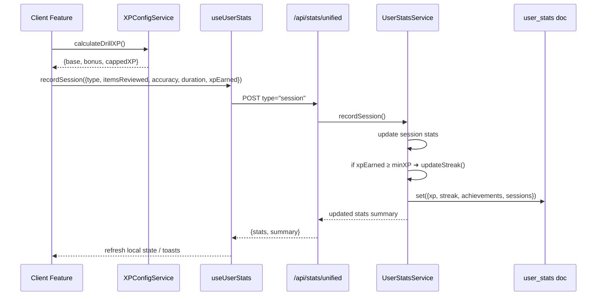

# Moshimoshi Gamification System Audit — 02 Oct 2025

**Author:** Roo
**Scope Window:** Streaks · XP · Achievements · Leaderboards · Bonus/notifications
**Deliverable:** Architectural assessment with remediation plan and supporting diagrams

---

## 1. Executive Summary

| Signal | Status | Notes |
| --- | --- | --- |
| Single-source statistics surface | ⚠️ Partially realized | [`useUserStats`](src/hooks/useUserStats.ts:53) correctly wraps the unified API, but [`useReviewStats`](src/hooks/useReviewStats.ts:26) maintains an alternate path with divergent caching semantics. |
| XP and streak cohesion | ✅ Confirmed | [`UserStatsService.recordSession`](src/lib/services/UserStatsService.ts:350) enforces the 10&nbsp;XP threshold via [`StreakConfigService.shouldCountForStreak`](src/lib/services/StreakConfigService.ts:71). |
| Legacy stores removed | ⚠️ Not complete | [`streakStore`](src/stores/streakStore.ts:1) and [`useAchievementStore`](src/stores/achievement-store.ts:1) still perform local writes and fallback persistence. |
| Offline-to-cloud sync | ❌ Disabled | [`DataSyncProvider`](src/components/sync/DataSyncProvider.tsx:20) returns early, preventing premium sync. |
| XP API parity | ⚠️ Inconsistent | Tests target `/api/xp/track` but no handler is present; XP updates presently flow through `/api/stats/unified`. |

**Key Risks**

1. **Sync gap for premium users.** Auto-sync is short-circuited, so IndexedDB/localStorage data is never escalated to Firestore unless users manually trigger unified API calls.
2. **Legacy fallbacks bypass the unified API.** [`updateProgress`](src/stores/achievement-store.ts:324) writes directly to `localStorage` on error, risking divergent streak histories.
3. **Undefined reference in achievement store.** Line 420 assigns `currentStreak: streak` without initializing `streak`, creating runtime instability.
4. **Competing hooks present conflicting truth sources.** Components may subscribe to stale review stats while the XP/streak engine advances elsewhere.

---

## 2. Architectural Overview

### 2.1 Core Services

| Responsibility | Implementation | Notes |
| --- | --- | --- |
| Stats orchestration | [`UserStatsService`](src/lib/services/UserStatsService.ts:105) | Enforces transactional updates (XP, streak, achievements, sessions) and triggers leaderboard sync. |
| Streak eligibility | [`StreakConfigService`](src/lib/services/StreakConfigService.ts:24) | Reads `config/xp-config.json` to compute minimum XP and eligible activities. |
| XP calculations & anti-cheat | [`XPConfigService`](src/lib/services/XPConfigService.ts:37) | Provides activity calculators, cooldown enforcement, suspicious-amount checks. |
| Leaderboard materialization | [`LeaderboardMaterializer`](src/lib/leaderboard/LeaderboardMaterializer.ts:44) | Debounced sync from `user_stats` to `leaderboard_stats`. |
| Notification fan-out | [`notificationService`](src/lib/notifications/notification-service.ts:43) | Sends daily reminders, achievements, weekly summaries using stats snapshots. |

### 2.2 API Surface

| Endpoint | Purpose | Source |
| --- | --- | --- |
| `GET /api/stats/unified` | Fetch or lazily create `user_stats` document | [`route.ts`](src/app/api/stats/unified/route.ts:18) |
| `POST /api/stats/unified` | Atomic updates (`streak`, `xp`, `achievement`, `session`, `repair`) | [`route.ts`](src/app/api/stats/unified/route.ts:55) |
| `PATCH /api/stats/unified` | Batch multi-operation transaction | [`route.ts`](src/app/api/stats/unified/route.ts:231) |
| `POST /api/progress/track` | Store per-item SRS progress, premium-only sync | [`route.ts`](src/app/api/progress/track/route.ts:13) |
| `GET /api/progress/track` | Retrieve progress (premium) or instruct local fallback | [`route.ts`](src/app/api/progress/track/route.ts:109) |
| `GET /api/leaderboard` | Provide cached leaderboard snapshot with mock fallback | [`route.ts`](src/app/api/leaderboard/route.ts:7) |
| `POST /api/leaderboard/update-stats` | Deprecated compatibility shim to unified stats | [`route.ts`](src/app/api/leaderboard/update-stats/route.ts:11) |
| `POST /api/kanji-mastery/session` | Persist kanji mastery session, XP totals | [`route.ts`](src/app/api/kanji-mastery/session/route.ts:63) |

### 2.3 Client Interfaces

- **Primary hook:** [`useUserStats`](src/hooks/useUserStats.ts:53) exposes the unified API and derived helpers (`useStreak`, `useXP`, `useAchievements`).
- **Legacy hook:** [`useReviewStats`](src/hooks/useReviewStats.ts:26) fetches `/api/review/stats` and falls back to IndexedDB/local caches.
- **Stores:** [`useAchievementStore`](src/stores/achievement-store.ts:89) remains Zustand-driven, with localStorage persistence and mixed API usage.

---

## 3. Data Flow Diagrams

### 3.1 Activity Completion → XP → Streak Cascade



### 3.2 Offline Progress Sync (Current Disabled State)

```mermaid
flowchart TD
    A[Client stores activity in IndexedDB/localStorage] --> B{Premium user?}
    B -- No --> C[Remain local only]
    B -- Yes --> D[DataSyncProvider]
    D -->|Currently returns| E[Sync aborted ⚠]
    D -->|After fix| F[POST /api/stats/unified type="streak"]
    F --> G[user_stats updated]
```

---

## 4. Cross-System Interactions

1. **Entitlements gating:** Drill launches invoke [`evaluate`](src/lib/entitlements/evaluator.ts:47) to confirm feature limits before hitting activity APIs.
2. **Review engine progress:** [`UniversalProgressManager.trackProgress`](src/lib/review-engine/progress/UniversalProgressManager.ts:176) funnels review completions into `recordSession`, awarding XP and updating streaks for premium users.
3. **Notifications:** [`notificationService.sendDailyReminder`](src/lib/notifications/notification-service.ts:58) reads `statistics/reviews` and `user_stats` to craft reminders, relying on streak accuracy.
4. **Leaderboard sync:** XP/streak updates enqueue [`leaderboardMaterializer.syncUserToLeaderboard`](src/lib/leaderboard/LeaderboardMaterializer.ts:68) to refresh materialized views, which feed the Redis-backed leaderboard API.
5. **Admin tooling:** `/api/admin/xp-config` exposes the XP schema for live tuning, while `/api/admin/stats-consistency/*` uses the same collections to audit drift.

---

## 5. Risk & Edge Case Analysis

| ID | Severity | Description | Evidence / Impact |
| --- | --- | --- | --- |
| R1 | Critical | **Auto-sync disabled** – premium offline data never persists to Firestore. | [`DataSyncProvider`](src/components/sync/DataSyncProvider.tsx:20) `return` statement blocks sync; offline sessions risk permanent loss. |
| R2 | High | **Undefined streak reference** – fallback path sets `currentStreak: streak` where `streak` is undefined. | [`useAchievementStore.updateProgress`](src/stores/achievement-store.ts:420) leads to runtime errors or `NaN` streak UI. |
| R3 | High | **Legacy persistence bypass** – store writes directly to `localStorage` on API failure without reconciliation. | [`updateProgress` fallback](src/stores/achievement-store.ts:381) does not re-sync automatically. |
| R4 | Medium | **Conflicting hooks** – `useReviewStats` vs `useUserStats` expose different stats versions. | Divergent semantics risk duplicate UI logic and confusion. |
| R5 | Medium | **Missing XP endpoint** – tests reference `/api/xp/track`, but no handler exists, risking future parity regressions. | `src/__tests__/xp-system/api-endpoints.test.ts` imports a non-existent route. |
| R6 | Medium | **Timezone fragility** – numerous repair scripts (`fix-future-date`, `cleanNestedDates`) indicate recurring calendar corruption. | Evidenced by `scripts/fix-future-date.js` and `cleanNestedDates` usage across services. |
| R7 | Low | **Leaderboard scalability** – full rebuild queries entire `user_stats` collection each run. | [`LeaderboardMaterializer.rebuildLeaderboard`](src/lib/leaderboard/LeaderboardMaterializer.ts:218) could strain Firestore at scale.

Edge conditions requiring explicit tests:

- Sessions finishing across local midnight boundaries.
- XP values below `minXPForStreak` to ensure streaks do not increment erroneously.
- Offline sequences >1 day followed by reconnect to validate sync once DataSyncProvider is fixed.

---

## 6. Recommendations

### 6.1 Immediate (0–2 weeks)

1. **Re-enable premium sync securely.**
   - Normalize all dates to UTC (ISO strings) before calling unified API.
   - Re-enable `syncDataToFirebase` and add regression tests for future-dated entries.
2. **Fix achievement store fallback.**
   - Guard the undefined variable (`const currentStreak = streakResult.currentStreak`) and route all writes through the unified API, removing direct localStorage mutations where possible.
3. **Audit hook usage.**
   - Deprecate `useReviewStats`, migrate consumers to `useUserStats`, and delete redundant API endpoints once adoption is complete.

### 6.2 Near Term (1–2 months)

1. **Eliminate legacy stores.**
   - Remove `streakStore` and consolidate streak state under the unified hook.
   - Replace `achievementManager` direct Firebase writes with server calls.
2. **Restore `/api/xp/track` or update tests.**
   - Either reinstate the endpoint or realign tests to `/api/stats/unified` to avoid future false negatives.
3. **Automate data quality checks.**
   - Schedule daily jobs that validate streak continuity, detect future-dated entries, and compare local caches against Firestore snapshots.

### 6.3 Strategic (Quarter+)

1. **Server-side streak recalculation.**
   - Nightly batch recompute using `calculateStreakFromDates` for canonical truth; client writes only append dates.
2. **Leaderboard incremental updates.**
   - Introduce change streams or batched user deltas rather than full rebuilds to scale toward 100k+ users.
3. **Gamification UX enhancements.**
   - Implement streak freeze/vacation and weekly XP goal mechanics to improve retention, leveraging existing XPConfig weights.

---

## 7. Follow-Up Tasks

| Owner | Task | Outcome |
| --- | --- | --- |
| Platform | Normalize and unit-test streak sync timezone handling | DataSyncProvider re-enabled without future-date defects. |
| Front-end | Remove `useReviewStats` consumers and delete hook | Single hook path prevents divergent caches. |
| Backend | Resolve `/api/xp/track` discrepancy | Tests align with deployed endpoints; XP pipeline documented. |
| Data team | Publish streak health monitoring dashboard | Early warning on streak integrity regressions. |

---

## Appendix A — Gamification Endpoint Inventory

| Category | Endpoint | Notes |
| --- | --- | --- |
| Stats | `GET/POST/PATCH /api/stats/unified` | Primary aggregation pipeline for XP, streaks, achievements. |
| Stats | `POST /api/progress/track` | SRS progress ingestion; premium sync gating. |
| Leaderboard | `GET /api/leaderboard` | Redis-backed snapshot, mock fallback for empty datasets. |
| Leaderboard | `POST /api/leaderboard/update-stats` | Deprecated shim forwarding to unified API. |
| Achievements | (Client) [`useAchievementStore`](src/stores/achievement-store.ts:89) | Requires refactor to rely solely on API. |
| Notifications | `GET /api/notifications/weekly-progress` | Cron entrypoint secured by bearer token. |
| Admin | `GET/POST /api/admin/xp-config` | Reads/writes `config/xp-config.json`, restricted to admins. |
| Admin | `POST /api/admin/stats-consistency/*` | Validation tooling to reconcile `user_stats` vs derived stores. |

---

**Prepared for:** Moshimoshi engineering leadership
**Next Review Checkpoint:** Recommend reassessment after completing immediate remediation items.
