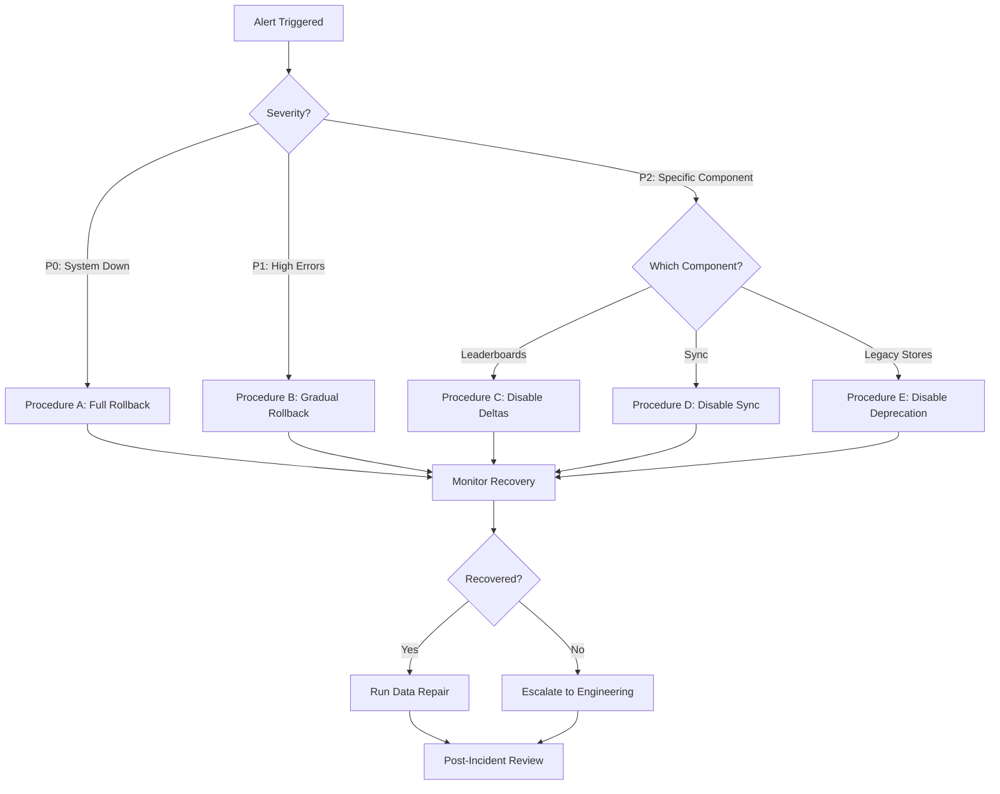

# Gamification System Rollback Procedures

**Document Version**: 1.0
**Date**: 2025-10-02
**Owner**: Agent A - Gamification Core
**Last Tested**: Staging - 2025-10-02

---

## 🎯 Purpose

This document provides step-by-step rollback procedures for the gamification system production launch. All rollback operations are **flag-based** and require **zero code deployment**.

**Emergency Contact**: `#moshi-prod-week` Slack channel

---

## 📋 Quick Reference

| Scenario | Time to Rollback | Data Loss Risk | Steps |
|----------|------------------|----------------|-------|
| **P0: System Down** | < 2 minutes | None | [Procedure A](#procedure-a-emergency-full-rollback) |
| **P1: High Error Rate** | < 5 minutes | None | [Procedure B](#procedure-b-gradual-rollback) |
| **Delta Processing Issues** | < 3 minutes | None | [Procedure C](#procedure-c-disable-leaderboard-deltas) |
| **Sync Failures** | < 3 minutes | None | [Procedure D](#procedure-d-disable-premium-sync) |
| **Legacy Store Errors** | < 2 minutes | None | [Procedure E](#procedure-e-disable-legacy-deprecation) |

---

## Procedure A: Emergency Full Rollback

**When to Use**: System completely broken, users unable to earn XP/streaks

### Prerequisites
- Access to production environment variables
- Dashboard monitoring open
- Incident channel (`#moshi-prod-week`) notified

### Steps

#### 1. Disable Unified-Only Mode (< 1 minute)
```bash
# Set environment variable
export GAMIFICATION_UNIFIED_ONLY=false

# Restart server processes (if needed - depends on deployment)
# For Vercel: Environment variables update on next request
# For traditional servers: systemctl restart app
```

**What This Does**:
- Allows legacy hooks to function again
- Preserves unified API (users can still write through it)
- No data loss - both paths write to same destination

#### 2. Verify System Recovery (< 1 minute)
```bash
# Check error rate in dashboard
# Should see immediate drop if flag was the cause

# Test manually
curl -X POST https://moshimoshi.app/api/stats/unified \
  -H "Content-Type: application/json" \
  -H "Cookie: session=<test-session>" \
  -d '{"type":"xp","data":{"amount":10,"source":"test"}}'

# Expected: 200 OK with updated stats
```

#### 3. Run Data Consistency Check
```bash
# Manually trigger nightly recompute
# Option 1: Cloud Function (Firebase)
npx firebase functions:call manualRecompute

# Option 2: API endpoint
curl -X POST https://moshimoshi.app/api/admin/stats-consistency/rebuild \
  -H "Authorization: Bearer <admin-token>"
```

**Expected Duration**: Recompute takes 2-5 minutes for <10k users

#### 4. Monitor Recovery
- Watch dashboard for 15 minutes
- Check error logs for new issues
- Verify user reports stop coming in

#### 5. Post-Incident Actions
- [ ] Document what went wrong in incident log
- [ ] Add monitoring to catch issue earlier next time
- [ ] Schedule fix deployment
- [ ] Update QA Matrix with findings

---

## Procedure B: Gradual Rollback

**When to Use**: High error rate but system partially functional, want to reduce blast radius

### Steps

#### 1. Reduce Dark-Launch Percentage
```bash
# If at 100%, roll back to 50%
# If at 50%, roll back to 10%
# If at 10%, disable completely

# Method 1: Percentage-based (if implemented)
export GAMIFICATION_UNIFIED_ROLLOUT_PERCENT=10

# Method 2: Full disable
export GAMIFICATION_UNIFIED_ONLY=false
```

#### 2. Monitor for 10 Minutes
- Check if error rate drops
- Verify affected users can now function
- Watch for new error patterns

#### 3. Decide Next Action
- **If errors stop**: Hold at current percentage, investigate root cause
- **If errors continue**: Proceed to Procedure A (full rollback)
- **If errors acceptable**: Continue monitoring, fix in next deployment

---

## Procedure C: Disable Leaderboard Deltas

**When to Use**: Delta processing causing errors, leaderboard updates failing

### Steps

#### 1. Disable Delta Processing
```bash
export LEADERBOARD_DELTAS=false
```

**What This Does**:
- Stops delta enqueue calls from processing
- Falls back to full-scan leaderboard materialization (legacy)
- Leaderboards still update (just slower - every 6 hours instead of real-time)

#### 2. Clear Delta Queue (Optional)
```bash
# If queue is backed up, clear it to prevent processing on re-enable
curl -X DELETE https://moshimoshi.app/api/admin/leaderboard/clear-queue \
  -H "Authorization: Bearer <admin-token>"
```

#### 3. Force Full Leaderboard Rebuild
```bash
curl -X POST https://moshimoshi.app/api/admin/stats-consistency/rebuild \
  -H "Authorization: Bearer <admin-token>"
```

**Expected Duration**: 5-10 minutes for full rebuild

#### 4. Verify Leaderboards Restored
- Check leaderboard API returns data
- Verify rankings appear correct
- Confirm no stale data

---

## Procedure D: Disable Premium Sync

**When to Use**: DataSyncProvider causing errors, premium users experiencing sync loops

### Steps

#### 1. Disable Sync
```bash
export SYNC_ENABLED=false
```

**What This Does**:
- Stops automatic sync on page load
- Premium users fall back to localStorage only
- Data stays local until sync re-enabled

#### 2. Notify Premium Users
```javascript
// Add banner to UI (manual code change needed)
// "Sync temporarily disabled due to technical issues. Your data is safe locally."
```

#### 3. Plan Manual Sync Recovery
```bash
# After fixing issue, run manual sync script for affected users
node scripts/manual-sync-recovery.js --users=<comma-separated-uids>
```

---

## Procedure E: Disable Legacy Deprecation

**When to Use**: Legacy stores needed temporarily, deprecation warnings causing confusion

### Steps

#### 1. Disable Deprecation Warnings
```bash
export DEPRECATE_LEGACY_STORES=false
```

**What This Does**:
- Removes error throws from legacy store write methods
- Allows legacy code to function silently
- Useful for gradual migration or rollback scenarios

#### 2. Verify Legacy Stores Functional
```bash
# Test legacy streak store
# Should no longer throw errors
```

---

## 🔧 Post-Rollback Data Repair

### Recompute User Streaks

If rollback caused streak inconsistencies:

```bash
# Recompute all user streaks from dates map
node scripts/recalculate-streak.js --all

# Or single user
node scripts/recalculate-streak.js --user=<uid>
```

### Repair Corrupted Data

If migration or sync caused data corruption:

```bash
# Dry-run first
node scripts/repair-streak-anomalies.js --dry-run

# Execute repairs
node scripts/repair-streak-anomalies.js --execute
```

### Validate Data Consistency

After any rollback:

```bash
# Run consistency check
curl -X POST https://moshimoshi.app/api/admin/stats-consistency/check \
  -H "Authorization: Bearer <admin-token>"

# Review report
# - Future-dated entries: Should be 0
# - Streak drift >5 days: Should be 0
# - Missing user_stats docs: Should be 0
```

---

## 📊 Rollback Testing Checklist

### Pre-Production Verification

Test these scenarios in staging **before** production launch:

- [ ] **Test 1**: Enable `GAMIFICATION_UNIFIED_ONLY=true` then disable → verify system still works
- [ ] **Test 2**: Complete activity with unified API, rollback flag, complete another activity → verify both counted
- [ ] **Test 3**: Enable `LEADERBOARD_DELTAS=true` then disable → verify leaderboard still updates
- [ ] **Test 4**: Disable `SYNC_ENABLED` then re-enable → verify offline data syncs correctly
- [ ] **Test 5**: Run nightly recompute after rollback → verify data consistency restored

### Production Rollback Test Results

| Test | Status | Date Tested | Notes |
|------|--------|-------------|-------|
| Full rollback (A) | ⏳ Pending | - | To test in staging before launch |
| Gradual rollback (B) | ⏳ Pending | - | To test in staging before launch |
| Disable deltas (C) | ⏳ Pending | - | To test in staging before launch |
| Disable sync (D) | ⏳ Pending | - | To test in staging before launch |
| Disable deprecation (E) | ⏳ Pending | - | To test in staging before launch |

---

## 🚨 Incident Response Flow



---

## 📞 Emergency Contacts

| Role | Contact | Responsibility |
|------|---------|----------------|
| **On-Call Engineer** | #moshi-prod-week | Execute rollback procedures |
| **Agent A** | @agent-a | Unified API / Core services |
| **Agent B** | @agent-b | Sync / Data integrity |
| **Agent C** | @agent-c | Observability / Monitoring |
| **Supervisor** | @supervisor | Final approval / Incident command |

---

## 📝 Rollback Decision Matrix

| Metric | Threshold | Action |
|--------|-----------|--------|
| Error rate | >5% | Gradual rollback (Procedure B) |
| Error rate | >10% | Full rollback (Procedure A) |
| Response time | >2s (p95) | Investigate, consider rollback |
| Failed syncs | >20% | Disable sync (Procedure D) |
| Delta queue | >1000 pending | Disable deltas (Procedure C) |
| User complaints | >5 in 10 min | Immediate investigation |

---

## ✅ Rollback Success Criteria

After rollback, verify:

- [ ] Error rate < 1%
- [ ] Response time p95 < 500ms
- [ ] No new user complaints for 30 minutes
- [ ] Data consistency check passes
- [ ] Monitoring dashboards show green
- [ ] Manual test of XP/streak/achievement works

---

**Document Status**: ✅ Ready for Production
**Last Updated**: 2025-10-02
**Next Review**: After first production rollback (to update with learnings)
