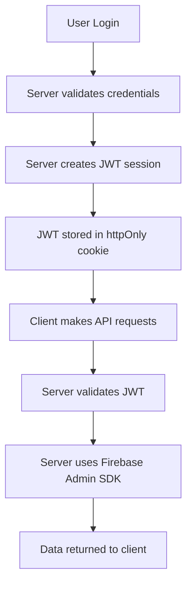

# Firebase Architecture Documentation

## Table of Contents
1. [Overview](#overview)
2. [Authentication Architecture](#authentication-architecture)
3. [Data Flow Patterns](#data-flow-patterns)
4. [API Endpoints](#api-endpoints)
5. [Security & Authorization](#security--authorization)
6. [Database Collections](#database-collections)
7. [Migration from Client-Side to Server-Side](#migration-from-client-side-to-server-side)
8. [Best Practices](#best-practices)

## Overview

The Moshimoshi application uses a **server-side Firebase Admin SDK architecture** for all database operations. This approach ensures consistent authentication, better security, and centralized data management.

### Key Principles
- **All Firebase writes go through server-side APIs**
- **No direct client-side Firebase authentication**
- **JWT-based session management**
- **Three-tier storage model**: Guest (none) → Free (IndexedDB) → Premium (IndexedDB + Firebase)

## Authentication Architecture

### Session Flow


### Key Components

#### 1. Session Management (`/src/lib/auth/session.ts`)
- Creates and validates JWT tokens
- Stores sessions in Redis with 24hr expiry
- Uses httpOnly cookies for security

#### 2. Firebase Admin SDK (`/src/lib/firebase/admin.ts`)
```typescript
// Server-side only - initialized with service account
import { initializeApp, cert } from 'firebase-admin/app'
import { getFirestore } from 'firebase-admin/firestore'

const serviceAccount = JSON.parse(
  process.env.FIREBASE_SERVICE_ACCOUNT_KEY!
)

const adminApp = initializeApp({
  credential: cert(serviceAccount)
})

export const adminDb = getFirestore(adminApp)
```

## Data Flow Patterns

### Pattern 1: Progress Tracking
**Used by**: UniversalProgressManager, KanaProgressManagerV2

```
Client → API → Firebase Admin SDK → Firestore
```

1. **Client**: Calls progress tracking methods
2. **API** (`/api/progress/track`): Validates session, processes data
3. **Firebase Admin**: Writes to Firestore using service account
4. **Response**: Returns success/failure to client

### Pattern 2: Achievement Updates
**Used by**: Achievement Store

```
Client → API → Calculate Streak → Firebase Admin SDK → Update Multiple Collections
```

1. **Client**: Reports activity completion
2. **API** (`/api/achievements/update-activity`):
   - Validates session
   - Calculates streak
   - Updates achievements
3. **Firebase Admin**: Batch updates to user document
4. **Response**: Returns updated streak data

### Pattern 3: Subscription Management
**Used by**: Stripe Webhooks, Subscription checks

```
Stripe Webhook → API → Firebase Admin SDK → Update Subscription
```

1. **Stripe**: Sends webhook event
2. **API** (`/api/stripe/webhook`): Validates webhook signature
3. **Firebase Admin**: Updates subscription status
4. **Side Effects**: Updates user permissions

## API Endpoints

### Progress Tracking
```typescript
// POST /api/progress/track
// Save progress data for content items
{
  contentType: string,
  items: Map<string, ProgressData>,
  reviewHistory?: ReviewHistoryEntry[]
}

// GET /api/progress/track?contentType=hiragana
// Load progress for a content type
Response: {
  items: Record<string, ProgressData>,
  contentType: string,
  lastUpdated: Date | null
}
```

### Achievement Updates
```typescript
// POST /api/achievements/update-activity
// Update user activity and calculate streak
{
  sessionType: string,
  itemsReviewed: number,
  accuracy: number,
  duration: number
}

Response: {
  success: boolean,
  currentStreak: number,
  bestStreak: number,
  message: string
}

// GET /api/achievements/data
// Load achievement data (unlocks, points)
Response: {
  unlocked: string[],
  totalPoints: number,
  totalXp: number,
  currentLevel: number,
  lessonsCompleted: number,
  statistics: object
}

// POST /api/achievements/data
// Save achievement data
{
  unlocked: string[],
  totalPoints: number,
  // ... other achievement fields
}

// GET /api/achievements/activities
// Load streak and activity data
Response: {
  dates: Record<string, boolean>,
  currentStreak: number,
  bestStreak: number,
  lastActivity: number
}

// POST /api/achievements/activities
// Save streak and activity data
{
  dates: Record<string, boolean>,
  currentStreak: number,
  bestStreak: number
}
```

### User Subscription
```typescript
// GET /api/user/subscription
// Get user's subscription status
Response: {
  subscription: {
    plan: 'free' | 'premium_monthly' | 'premium_yearly',
    status: 'active' | 'canceled' | 'past_due',
    currentPeriodEnd?: string
  }
}
```

### Sessions Management
```typescript
// POST /api/sessions/save
// Save a learning session (premium only)
{
  session: ProgressSessionSummary
}
```

## Security & Authorization

### Authentication Middleware
All protected API routes use session validation:

```typescript
// Use getSession() from @/lib/auth/session for consistency
import { getSession } from '@/lib/auth/session'

const session = await getSession()
if (!session?.uid) {
  return NextResponse.json(
    { error: 'Unauthorized' },
    { status: 401 }
  )
}
```

**Important Note**: There are two session functions in the codebase:
- `getSession()` from `/lib/auth/session.ts` - Returns `SessionUser` with `uid` property (USE THIS)
- `getServerSession()` from `/lib/auth.ts` - Returns NextAuth-compatible format with `user.id`

All Firebase Admin SDK routes should use `getSession()` for consistency with existing patterns (Stripe, etc.)

### Premium Features Check

#### Client-Side Subscription Detection
```typescript
// USE THIS PATTERN IN COMPONENTS
import { useSubscription } from '@/hooks/useSubscription'

const { subscription, isPremium } = useSubscription()

// The hook fetches from /api/user/subscription
// Returns cached data to avoid repeated API calls
```

#### Server-Side Subscription Check (API Routes)
```typescript
// In API routes, check directly from Firebase
const userDoc = await adminDb.collection('users').doc(session.uid).get()
const userData = userDoc.data()
const isPremium = userData?.subscription?.plan === 'premium_monthly' ||
                  userData?.subscription?.plan === 'premium_yearly'
```

#### CRITICAL: Passing Premium Status to Stores
```typescript
// When initializing stores that sync with Firebase
// MUST pass isPremium status explicitly

// ✅ CORRECT
const { isPremium } = useSubscription()
achievementStore.initialize(userId, isPremium)

// ❌ WRONG - Will default to free tier
achievementStore.initialize(userId)
```

### Why Client-Side Firebase Doesn't Work
1. **Authentication is server-side only** - No Firebase Auth on client
2. **Client Firebase calls fail** - No authentication context
3. **Must use API endpoints** - All Firebase operations through server
4. **Premium detection must be explicit** - Cannot auto-detect from client

### Admin Status Check
**CRITICAL**: The admin field in Firebase user documents is `isAdmin`, not `admin`.

#### Correct Admin Check Pattern
```typescript
// ✅ CORRECT - Check for isAdmin field
const userDoc = await adminFirestore.collection('users').doc(uid).get()
const userData = userDoc.data()
const isAdmin = userData?.isAdmin === true

// ❌ WRONG - Checking wrong field name
const isAdmin = userData?.admin === true  // This field doesn't exist!
```

#### Setting Admin Status
To make a user admin, set the `isAdmin` field in their user document:
```typescript
await adminFirestore.collection('users').doc(userId).update({
  isAdmin: true
})
```

### Firestore Security Rules
```javascript
// firestore.rules
service cloud.firestore {
  match /databases/{database}/documents {
    // Only server can write (using Admin SDK)
    match /users/{userId} {
      allow read: if request.auth != null && request.auth.uid == userId;
      allow write: if false; // Only Admin SDK
    }

    // Subcollections follow parent rules
    match /users/{userId}/{document=**} {
      allow read: if request.auth != null && request.auth.uid == userId;
      allow write: if false; // Only Admin SDK
    }
  }
}
```

## Database Collections

### Users Collection
```typescript
/users/{userId}
{
  email: string,
  displayName: string,
  photoURL?: string,
  isAdmin?: boolean,  // IMPORTANT: Admin field is 'isAdmin', not 'admin'
  subscription: {
    plan: 'free' | 'premium_monthly' | 'premium_yearly',
    status: 'active' | 'canceled' | 'past_due',
    stripeCustomerId?: string,
    currentPeriodEnd?: Timestamp
  },
  achievements: {
    currentStreak: number,
    bestStreak: number,
    lastActivity?: Timestamp,
    totalSessions: number,
    totalTimeSpent: number,
    totalItemsLearned: number
  },
  preferences: {
    theme: 'light' | 'dark' | 'system',
    language: string,
    notifications: boolean
  },
  createdAt: Timestamp,
  updatedAt: Timestamp
}
```

### Progress Subcollection
```typescript
/users/{userId}/progress/{contentType}
{
  items: Record<string, ReviewProgressData>,
  lastUpdated: Timestamp,
  contentType: string,
  userId: string
}
```

### Achievements Subcollection
```typescript
/users/{userId}/achievements/data
{
  unlocked: string[],           // Achievement IDs
  totalPoints: number,
  totalXp: number,
  currentLevel: string,
  lessonsCompleted: number,
  lastUpdated: string,
  statistics: {
    percentageComplete: number,
    byCategory: Record<string, number>
  }
}

/users/{userId}/achievements/activities
{
  dates: Record<string, boolean>,  // Daily activity tracking
  currentStreak: number,
  bestStreak: number,
  lastActivity: number
}
```

### Sessions Subcollection
```typescript
/users/{userId}/sessions/{sessionId}
{
  sessionId: string,
  userId: string,
  contentType: string,
  startedAt: Timestamp,
  endedAt?: Timestamp,
  duration: number,
  itemsViewed: string[],
  itemsCompleted: string[],
  accuracy: number,
  syncedAt: Timestamp
}
```

### Review History Subcollection
```typescript
/users/{userId}/review_history/{entryId}
{
  userId: string,
  contentType: string,
  contentId: string,
  timestamp: Timestamp,
  event: ProgressEvent,
  correct?: boolean,
  responseTime?: number,
  sessionId?: string,
  deviceType: 'mobile' | 'tablet' | 'desktop'
}
```

## Migration from Client-Side to Server-Side

### Before (Client-Side Pattern)
```typescript
// ❌ OLD: Direct client-side Firebase
import { auth, firestore } from '@/lib/firebase/client'

const user = auth.currentUser
if (user) {
  await setDoc(doc(firestore, 'users', user.uid), data)
}
```

### After (Server-Side Pattern)
```typescript
// ✅ NEW: Server API call
const response = await fetch('/api/progress/track', {
  method: 'POST',
  headers: { 'Content-Type': 'application/json' },
  body: JSON.stringify({ contentType, items })
})
```

### Authentication Functions Reference
```typescript
// In API routes, always use:
import { getSession } from '@/lib/auth/session'
const session = await getSession()
// session.uid - direct access to user ID
// session.email - user email
// session.tier - subscription tier

// NOT this (different format):
import { getServerSession } from '@/lib/auth'
const session = await getServerSession()
// session.user.id - nested structure (NextAuth compatibility)
```

### Migration Steps Completed

1. **Created Server APIs**
   - `/api/progress/track` - Progress tracking
   - `/api/achievements/update-activity` - Achievement updates
   - `/api/user/subscription` - Subscription status
   - `/api/sessions/save` - Session storage

2. **Updated Client Code**
   - UniversalProgressManager: Removed Firebase client imports
   - Achievement Store: Uses server API for updates
   - KanaProgressManagerV2: Inherits server-side behavior

3. **Removed Dependencies**
   - No more `firebase/auth` imports in client code
   - No more `firebase/firestore` direct usage
   - All Firebase operations go through Admin SDK

## Best Practices

### 1. Always Validate Sessions
```typescript
const session = await getServerSession()
if (!session?.uid) {
  return unauthorized()
}
```

### 2. Use Batch Operations
```typescript
// For multiple updates, use batch
const batch = adminDb.batch()
batch.update(userRef, { field1: value1 })
batch.update(progressRef, { field2: value2 })
await batch.commit()
```

### 3. Handle Premium Features
```typescript
// Check premium status before premium operations
if (isPremium) {
  // Save to Firebase
  await saveToFirebase(data)
} else {
  // Only save to IndexedDB
  await saveToIndexedDB(data)
}
```

### 4. Error Handling
```typescript
try {
  const result = await adminDb.collection('users').doc(uid).get()
  // Process result
} catch (error) {
  console.error('[API] Firebase operation failed:', error)
  // Return graceful error
  return NextResponse.json(
    { error: 'Database operation failed' },
    { status: 500 }
  )
}
```

### 5. Timestamp Handling
```typescript
// Use FieldValue.serverTimestamp() for consistency
import { FieldValue } from 'firebase-admin/firestore'

await docRef.set({
  updatedAt: FieldValue.serverTimestamp()
})
```

### 6. Data Validation
```typescript
// Always validate incoming data
if (!contentType || !items) {
  return NextResponse.json(
    { error: 'Missing required fields' },
    { status: 400 }
  )
}
```

## Testing

### Test Authentication
```bash
# Test with valid session
curl -X POST http://localhost:3000/api/progress/track \
  -H "Content-Type: application/json" \
  -H "Cookie: moshimoshi_jwt=<valid_token>" \
  -d '{"contentType": "hiragana", "items": []}'

# Test without session (should return 401)
curl -X POST http://localhost:3000/api/progress/track \
  -H "Content-Type: application/json" \
  -d '{"contentType": "hiragana", "items": []}'
```

### Test Script
```javascript
// test-progress-tracking.js
const response = await fetch('/api/progress/track', {
  method: 'POST',
  headers: { 'Content-Type': 'application/json' },
  body: JSON.stringify({
    contentType: 'hiragana',
    items: [['あ', progressData]]
  })
})
```

## Monitoring & Debugging

### Enable Debug Logging
```typescript
// In your API routes
console.log(`[API ${endpoint}] User ${session.uid} - Action: ${action}`)
```

### Check Firebase Admin Connection
```typescript
// Verify Admin SDK is initialized
if (!adminDb) {
  console.error('Firebase Admin SDK not initialized')
  throw new Error('Database connection failed')
}
```

### Monitor API Performance
```typescript
const startTime = Date.now()
// ... perform operation ...
const duration = Date.now() - startTime
console.log(`[API Performance] ${endpoint} took ${duration}ms`)
```

## Common Issues & Solutions

### Issue: "User not authenticated"
**Solution**: Ensure JWT cookie is present and valid
```typescript
// Check cookie exists
const token = cookies().get('moshimoshi_jwt')
if (!token) {
  // User needs to log in
}
```

### Issue: "getServerSession is not a function"
**Solution**: Import from the correct file
```typescript
// ✅ CORRECT - Use this in API routes
import { getSession } from '@/lib/auth/session'

// ❌ WRONG - Don't import from wrong file
import { getServerSession } from '@/lib/auth/session' // This doesn't exist!

// ⚠️ ALTERNATIVE - Only if you need NextAuth format
import { getServerSession } from '@/lib/auth' // Returns different format
```

### Issue: "Firebase operation failed"
**Solution**: Check service account credentials
```bash
# Verify environment variable is set
echo $FIREBASE_SERVICE_ACCOUNT_KEY

# Check Admin SDK initialization
```

### Issue: "Progress not syncing"
**Solution**: Verify API endpoint is being called
```typescript
// Add logging in UniversalProgressManager
console.log('[Progress] Syncing to Firebase:', items.size, 'items')
```

## Future Improvements

1. **WebSocket Support**: Real-time sync for collaborative features
2. **Caching Layer**: Redis caching for frequently accessed data
3. **Rate Limiting**: Protect APIs from abuse
4. **Batch API**: Single endpoint for multiple operations
5. **GraphQL**: More flexible data fetching
6. **Audit Logging**: Track all data modifications

## Conclusion

The server-side Firebase architecture provides:
- ✅ Consistent authentication across all features
- ✅ Better security with no client-side credentials
- ✅ Centralized data validation and processing
- ✅ Easier debugging and monitoring
- ✅ Simpler client code without Firebase dependencies

This architecture follows the same pattern as Stripe webhook integration, ensuring consistency across the entire application.