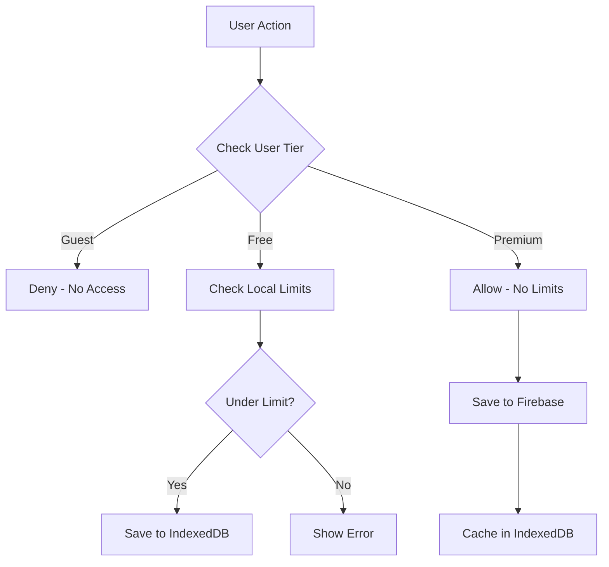

# Flashcard Entitlements Configuration

## Overview
The flashcard system uses a tiered entitlement model with different limits based on user subscription status. Entitlements are enforced both client-side (for UX) and server-side (for security).

## Subscription Tiers

### 1. Guest Users
- **Plan**: `guest`
- **Max Decks**: 0 (cannot create decks)
- **Cards per Deck**: 0
- **Daily Reviews**: 0
- **Storage**: None
- **Sync**: Not available

### 2. Free Users
- **Plan**: `free`
- **Max Decks**: 10
- **Cards per Deck**: 100
- **Daily Reviews**: 50
- **Storage**: IndexedDB (local only)
- **Sync**: Not available

### 3. Premium Monthly
- **Plan**: `premium_monthly`
- **Max Decks**: Unlimited (-1)
- **Cards per Deck**: Unlimited (-1)
- **Daily Reviews**: Unlimited (-1)
- **Storage**: IndexedDB + Firebase
- **Sync**: Full cloud sync

### 4. Premium Yearly
- **Plan**: `premium_yearly`
- **Max Decks**: Unlimited (-1)
- **Cards per Deck**: Unlimited (-1)
- **Daily Reviews**: Unlimited (-1)
- **Storage**: IndexedDB + Firebase
- **Sync**: Full cloud sync

## Configuration Locations

### 1. Feature Configuration
**File**: `/config/features.v1.json`
```json
{
  "flashcards": {
    "maxDecksPerUser": {
      "guest": 0,
      "free": 10,
      "premium": -1
    },
    "maxCardsPerDeck": {
      "guest": 0,
      "free": 100,
      "premium": -1
    },
    "dailyReviewLimit": {
      "guest": 0,
      "free": 50,
      "premium": -1
    }
  }
}
```

### 2. Client-Side Enforcement
**File**: `/src/lib/flashcards/FlashcardManager.ts`

#### Instance Method (lines 567-574)
```typescript
getDeckLimits(userTier: string): { maxDecks: number; dailyReviews: number; maxCardsPerDeck: number } {
  const limits: Record<string, { maxDecks: number; dailyReviews: number; maxCardsPerDeck: number }> = {
    guest: { maxDecks: 0, dailyReviews: 0, maxCardsPerDeck: 0 },
    free: { maxDecks: 10, dailyReviews: 50, maxCardsPerDeck: 100 },
    premium_monthly: { maxDecks: -1, dailyReviews: -1, maxCardsPerDeck: -1 },
    premium_yearly: { maxDecks: -1, dailyReviews: -1, maxCardsPerDeck: -1 }
  };
  return limits[userTier] || limits.free;
}
```

#### Static Method (lines 735-747)
```typescript
static getDeckLimits(tier: string): { maxDecks: number; dailyReviews: number } {
  switch (tier) {
    case 'guest':
      return { maxDecks: 0, dailyReviews: 0 };
    case 'free':
      return { maxDecks: 10, dailyReviews: 50 };
    case 'premium_monthly':
    case 'premium_yearly':
      return { maxDecks: -1, dailyReviews: -1 }; // Unlimited
    default:
      return { maxDecks: 10, dailyReviews: 50 };
  }
}
```

### 3. Server-Side Enforcement
**File**: `/src/app/api/flashcards/decks/route.ts` (lines 95-109)

```typescript
// Check limits based on plan
const limits: Record<string, number> = {
  guest: 0,
  free: 10,
  premium_monthly: -1, // Unlimited
  premium_yearly: -1   // Unlimited
};

const maxDecks = limits[plan] ?? 10;

if (maxDecks !== -1 && currentCount >= maxDecks) {
  return NextResponse.json(
    { error: 'Deck limit reached for your plan' },
    { status: 403 }
  );
}
```

### 4. UI Enforcement
**File**: `/src/app/flashcards/page.tsx`

#### Getting User Tier (lines 46-48)
```typescript
const userTier = subscription?.plan || (user ? 'free' : 'guest');
const limits = FlashcardManager.getDeckLimits(userTier);
```

#### Checking Deck Creation Limit (lines 125-127)
```typescript
if (limits.maxDecks !== -1 && decks.length >= limits.maxDecks) {
  showToast(t('flashcards.errors.limitReached'), 'error');
  return;
}
```

#### Warning When Approaching Limit (lines 408-415)
```typescript
{user && !isPremium && decks.length >= limits.maxDecks - 2 && (
  <div className="mb-6 p-4 bg-blue-50 dark:bg-blue-900/20 border border-blue-200 dark:border-blue-800 rounded-lg">
    <p className="text-blue-800 dark:text-blue-200">
      {t('flashcards.limits.freeLimit', {
        current: decks.length,
        max: limits.maxDecks
      })}
    </p>
  </div>
)}
```

## Subscription Detection

### 1. Using useSubscription Hook
```typescript
const { subscription, isPremium } = useSubscription();
```

### 2. Subscription Types
**File**: `/src/lib/stripe/types.ts`
```typescript
export type SubscriptionPlan = 'free' | 'premium_monthly' | 'premium_yearly';
export type SubscriptionStatus = 'active' | 'incomplete' | 'past_due' | 'canceled' | 'trialing';
```

### 3. Premium Detection Logic
**File**: `/src/hooks/useSubscription.ts` (lines 169-170)
```typescript
const isPremium = isLoading ? undefined :
  (subscription?.plan === 'premium_monthly' || subscription?.plan === 'premium_yearly');
```

## Storage Strategy by Tier

### Free Users
- **Primary Storage**: IndexedDB
- **Sync**: None
- **Backup**: None
- **Decision Logic**: `shouldWriteToFirebase = false`

### Premium Users
- **Primary Storage**: Firebase
- **Cache**: IndexedDB
- **Sync**: Automatic with conflict resolution
- **Backup**: Cloud (Firebase)
- **Decision Logic**: `shouldWriteToFirebase = true`

## Enforcement Flow



## Testing Entitlements

```javascript
// Test free user limits
FlashcardManager.getDeckLimits('free');
// Returns: { maxDecks: 10, dailyReviews: 50 }

// Test premium limits
FlashcardManager.getDeckLimits('premium_monthly');
// Returns: { maxDecks: -1, dailyReviews: -1 }
```

## Common Issues & Solutions

### Issue 1: Duplicate Limit Definitions
**Problem**: Limits defined in multiple places can get out of sync
**Solution**: Consider centralizing in `/config/features.v1.json`

### Issue 2: Static vs Instance Methods
**Problem**: Two different `getDeckLimits` methods with slightly different signatures
**Solution**: Consolidate into a single static method

### Issue 3: Daily Review Tracking
**Problem**: Daily review limit not actually enforced (TODO comment in code)
**Solution**: Implement tracking in Firebase or IndexedDB

### Issue 4: Card Per Deck Limit
**Problem**: `maxCardsPerDeck` defined but not enforced
**Solution**: Add enforcement when adding cards

## Recommendations

1. **Centralize Configuration**: Move all limits to `/config/features.v1.json`
2. **Implement Daily Tracking**: Add daily review counting mechanism
3. **Add Card Limit Enforcement**: Check card count when adding new cards
4. **Unify Methods**: Consolidate duplicate `getDeckLimits` methods
5. **Add Monitoring**: Track limit violations and upgrade prompts

## Related Files
- `/config/features.v1.json` - Feature configuration
- `/src/lib/flashcards/FlashcardManager.ts` - Core business logic
- `/src/app/api/flashcards/decks/route.ts` - Server-side enforcement
- `/src/app/flashcards/page.tsx` - UI implementation
- `/src/hooks/useSubscription.ts` - Subscription detection
- `/src/lib/stripe/types.ts` - Subscription type definitions

---

Last Updated: 2025-01-26
Author: Claude (Flashcard System Specialist)