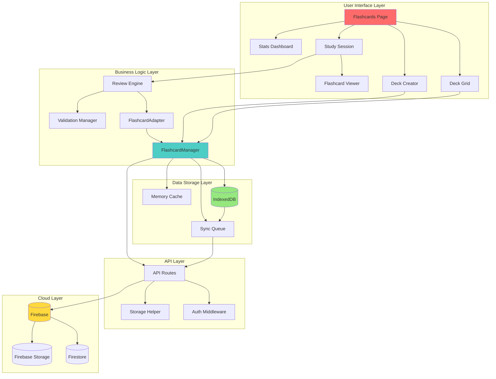
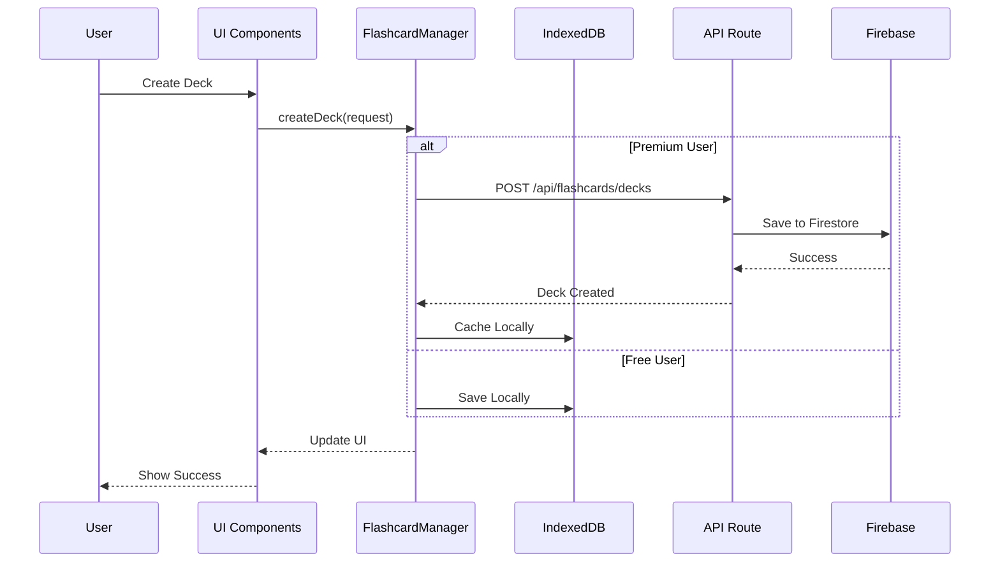
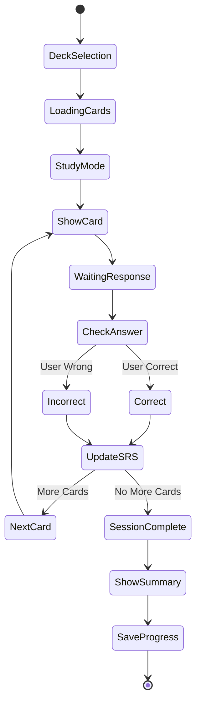
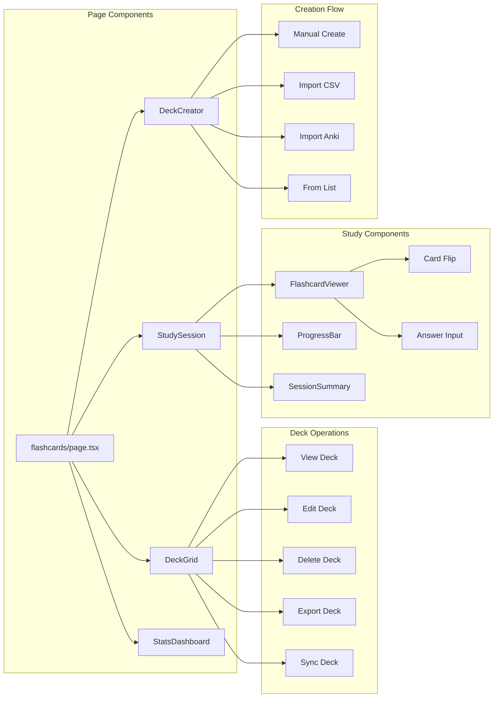
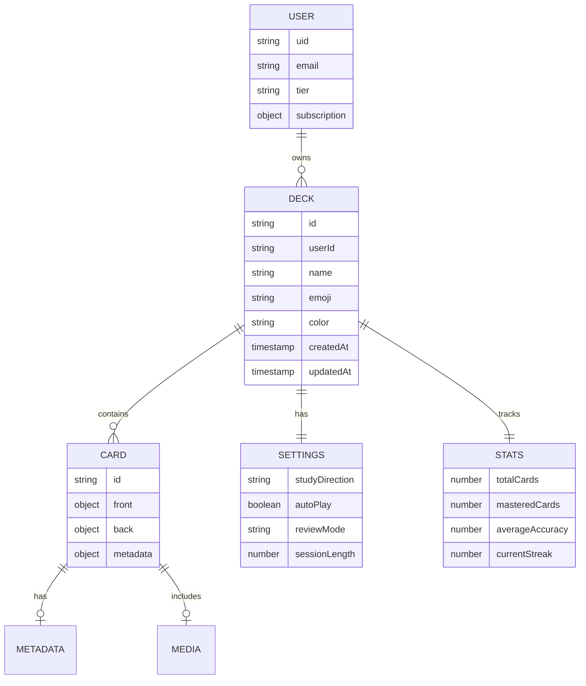
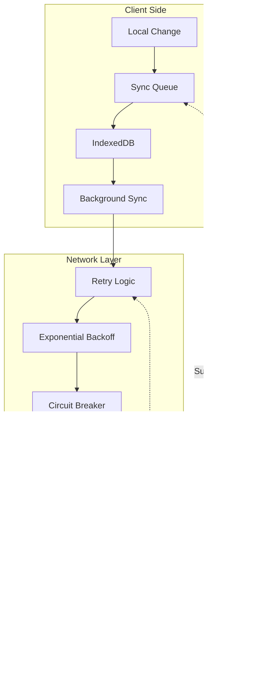
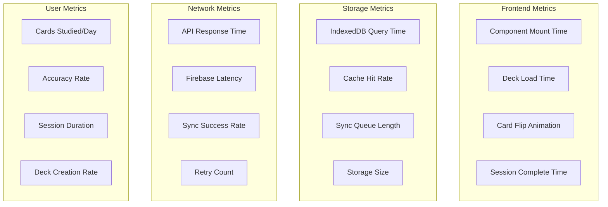
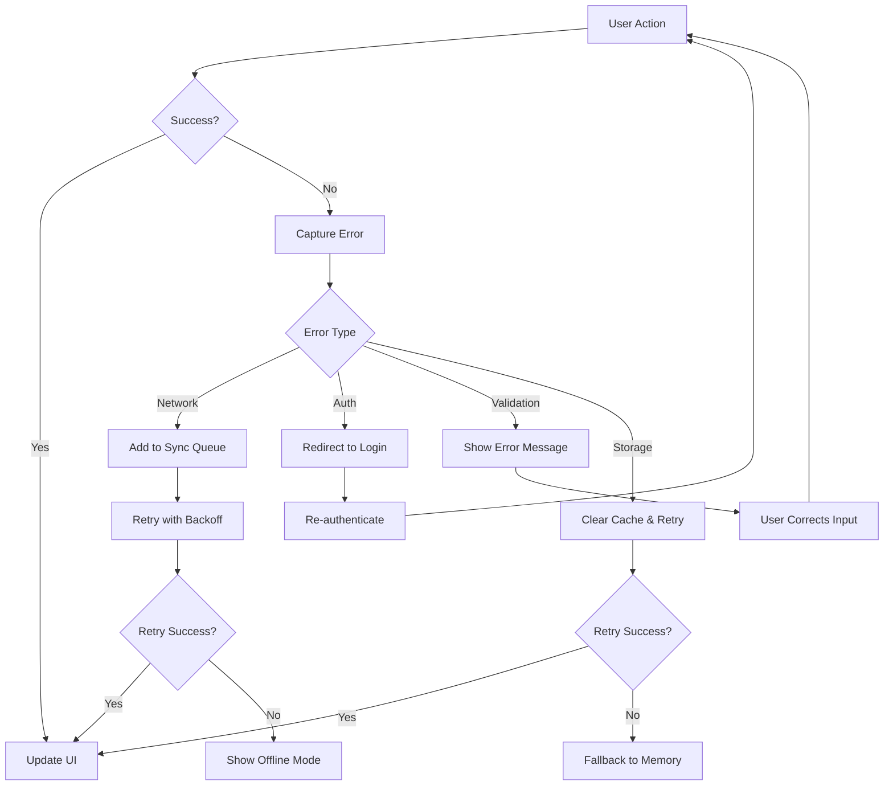
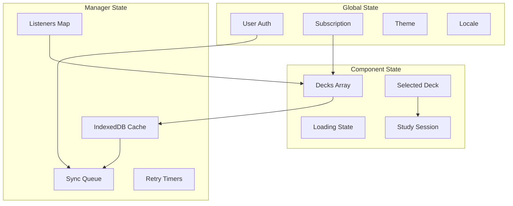

# Flashcard System - Interactive Feature Diagram

## System Overview

## User Flow Diagram

## Study Session Flow

## Component Interaction Map

## Data Model Relationships

## Sync Architecture

## Performance Monitoring Points

## Error Flow Handling

## State Management Flow

---

## Legend

- 🔴 **Red**: User Interface Components
- 🟢 **Green**: Storage Systems
- 🔵 **Blue**: Business Logic
- 🟡 **Yellow**: External Services
- ➡️ **Solid Arrow**: Direct Dependency
- ⚡ **Dashed Arrow**: Async Operation
- 🔄 **Circular**: Retry/Loop Process

---

Last Updated: 2025-01-26
Interactive Version: Can be viewed with any Mermaid renderer