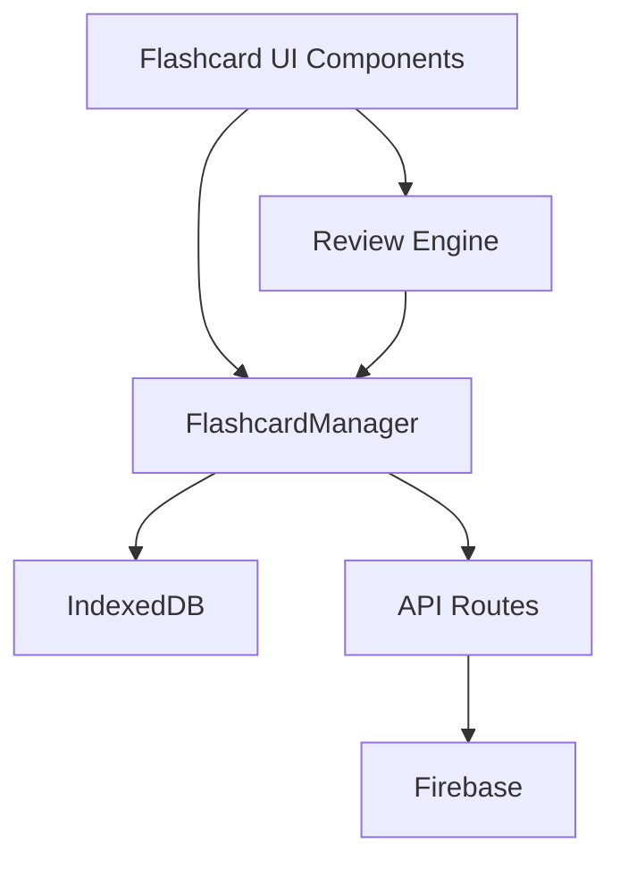

# Flashcard System Documentation

## System Architecture Overview

### Core Components



## Feature Dependencies

### Primary Dependencies
1. **Authentication System** (`/hooks/useAuth`)
   - User identification
   - Session management
   - Premium tier detection

2. **Subscription System** (`/hooks/useSubscription`)
   - Premium status verification
   - Tier-based limits enforcement
   - Feature gating

3. **Review Engine** (`/lib/review-engine/`)
   - SRS algorithm implementation
   - Progress tracking
   - Validation system
   - Offline sync capabilities

4. **Storage Systems**
   - **IndexedDB** (all users)
     - Primary storage for free users
     - Cache for premium users
     - Offline support
   - **Firebase** (premium only)
     - Cloud persistence
     - Cross-device sync
     - Backup storage

5. **i18n System** (`/i18n/`)
   - Multi-language support
   - Dynamic text rendering
   - Locale management

### Secondary Dependencies
- **Toast notifications** for user feedback
- **Dialog system** for confirmations
- **Loading overlays** for async operations
- **Theme system** for consistent styling
- **Animation libraries** (Framer Motion)

## Data Flow Architecture

### Create Deck Flow
```
User Action → FlashcardManager →
├── Premium User → API Route → Firebase → IndexedDB (cache)
└── Free User → IndexedDB (direct)
```

### Sync Flow (Premium Only)
```
Local Change → Sync Queue → Background Sync → Firebase
                    ↓
            Retry with Exponential Backoff
```

## Storage Strategy

### IndexedDB Structure
```javascript
Database: FlashcardDB
├── Object Store: decks
│   ├── Index: userId
│   ├── Index: updatedAt
│   └── Index: sourceListId
└── Object Store: syncQueue
    └── Index: timestamp
```

### Firebase Structure
```
/users/{userId}/
├── flashcardDecks/
│   └── {deckId}/
│       ├── cards[]
│       ├── settings{}
│       ├── stats{}
│       └── metadata
└── usage/
    └── {date}/
        └── flashcard_decks{}
```

## API Endpoints

### Deck Management
- `GET /api/flashcards/decks` - Fetch all user decks
- `POST /api/flashcards/decks` - Create new deck
- `PUT /api/flashcards/decks/[id]` - Update deck
- `DELETE /api/flashcards/decks/[id]` - Delete deck

### Card Management
- `POST /api/flashcards/decks/[id]/cards` - Add card
- `PUT /api/flashcards/decks/[id]/cards/[cardId]` - Update card
- `DELETE /api/flashcards/decks/[id]/cards/[cardId]` - Remove card

## User Tier Limits

| Feature | Guest | Free | Premium |
|---------|-------|------|---------|
| Max Decks | 0 | 10 | Unlimited |
| Cards per Deck | 0 | 100 | Unlimited |
| Daily Reviews | 0 | 50 | Unlimited |
| Cloud Sync | ❌ | ❌ | ✅ |
| Export/Import | ❌ | ✅ | ✅ |
| Offline Mode | ❌ | ✅ | ✅ |

## Component Hierarchy

```
/flashcards/page.tsx (Main Page)
├── Navbar
├── LearningPageHeader
├── StatsDashboard
│   ├── ProgressChart
│   ├── HeatMap
│   └── StatsCards
├── DeckGrid
│   ├── DeckCard
│   └── CreateDeckCard
├── DeckCreator (Modal)
│   ├── DeckForm
│   ├── CardEditor
│   └── ImportWizard
└── StudySession
    ├── FlashcardViewer
    ├── ProgressBar
    └── SessionSummary
```

## Review Engine Integration

### Adapter Pattern
```typescript
FlashcardAdapter extends BaseContentAdapter
├── transform() - Convert to ReviewableContent
├── prepareForMode() - Mode-specific preparation
├── generateOptions() - Multiple choice generation
├── generateHints() - Progressive hint system
└── calculateDifficulty() - Dynamic difficulty
```

### SRS Configuration
```javascript
{
  initialEaseFactor: 2.5,
  minEaseFactor: 1.3,
  maxEaseFactor: 2.5,
  learningSteps: [10, 30], // minutes
  graduatingInterval: 1, // days
  maxInterval: 365,
  leechThreshold: 8
}
```

## Performance Metrics

### Target Performance
- Deck load: < 100ms
- Card flip animation: < 400ms
- Sync operation: < 1000ms
- IndexedDB query: < 50ms
- Firebase write: < 500ms

### Current Performance Issues
1. Large deck loading (100+ cards) can be slow
2. Initial IndexedDB setup takes ~200ms
3. Bulk operations not optimized
4. No pagination for deck list

## Known Issues & Bugs

### Critical Issues
1. **Sync Conflict** - When offline changes conflict with Firebase
2. **Deck Duplication** - On sync failure, decks can duplicate
3. **Card Order** - Cards don't maintain consistent order after sync

### Minor Issues
1. **UI Flash** - Brief flash when switching between decks
2. **Stats Calculation** - Accuracy not updating immediately
3. **Export Format** - CSV export loses media references
4. **Import Validation** - No size limits on imports

## Error Patterns

### Common Errors
```javascript
// Firebase quota exceeded
FirebaseError: Quota exceeded (storage/quota-exceeded)

// IndexedDB blocked
DOMException: The user denied permission to access the database

// Sync timeout
Error: Sync operation timed out after 30000ms

// Invalid deck structure
TypeError: Cannot read property 'cards' of undefined
```

## Security Considerations

1. **User Data Isolation** - Each user can only access their own decks
2. **Input Validation** - All user inputs sanitized
3. **Rate Limiting** - API endpoints have rate limits
4. **Size Limits** - Max deck size enforced
5. **Authentication** - All API routes require valid session

## Migration Strategy

### Database Migrations
```javascript
// Version 1 → 2: Add metadata field
if (oldVersion < 2) {
  // Add metadata to existing cards
}

// Version 2 → 3: Add sync queue
if (oldVersion < 3) {
  // Create sync queue object store
}
```

## Testing Requirements

### Unit Tests Needed
- [ ] FlashcardManager CRUD operations
- [ ] Sync queue processing
- [ ] Conflict resolution
- [ ] Import/Export functions
- [ ] SRS calculations

### Integration Tests Needed
- [ ] Full study session flow
- [ ] Offline → Online sync
- [ ] Premium upgrade flow
- [ ] Bulk operations
- [ ] Cross-browser compatibility

## Performance Optimization Opportunities

1. **Lazy Loading** - Load cards on demand
2. **Virtual Scrolling** - For large deck lists
3. **Batch Operations** - Group Firebase writes
4. **Caching Strategy** - Implement proper cache invalidation
5. **Web Workers** - Move heavy operations off main thread

## Future Enhancements

### Short Term
- Add deck sharing functionality
- Implement deck templates
- Add more import formats (Quizlet, etc.)
- Improve conflict resolution UI

### Long Term
- AI-powered card generation
- Collaborative study sessions
- Advanced analytics dashboard
- Gamification features
- Mobile app sync

---

Last Updated: 2025-01-26
Author: Claude (Flashcard System Specialist)