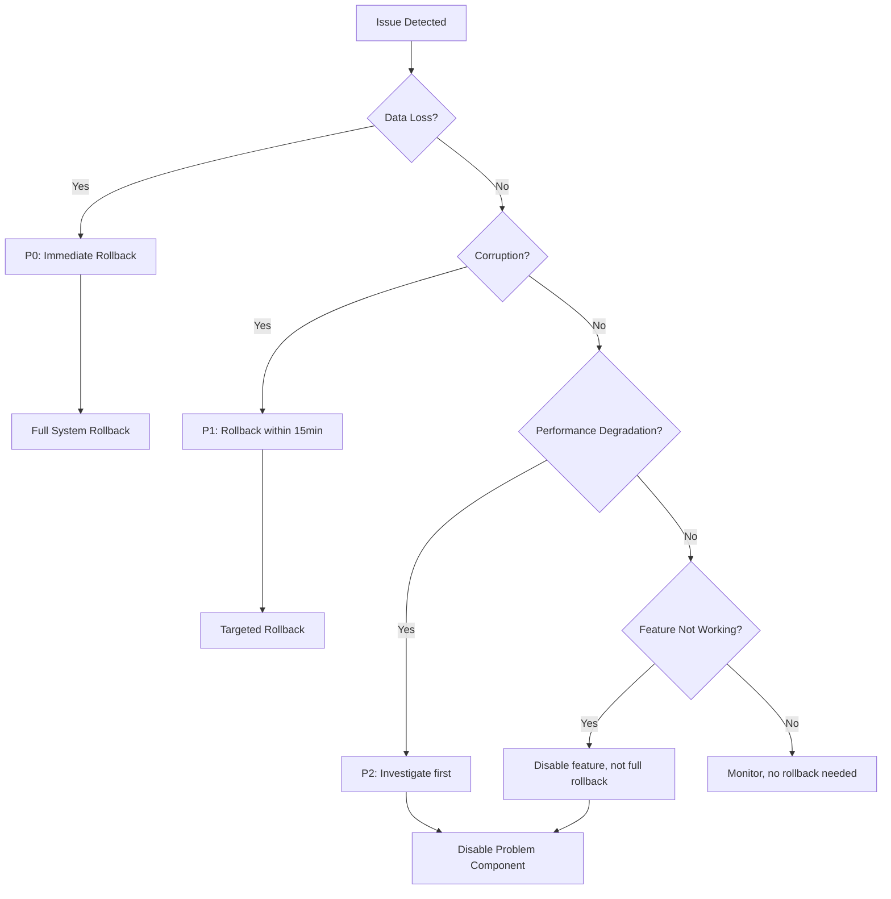

# Gamification System Rollback Playbook

**Version**: 1.0
**Last Updated**: October 2, 2025
**Owner**: Agent B - Data & Sync Specialist
**Severity**: P0 (Production Critical)

---

## 🚨 Emergency Contacts

| Role | Contact | Availability |
|------|---------|--------------|
| **Primary On-Call** | Agent B | 24/7 |
| **Backup On-Call** | Agent C (Observability) | 24/7 |
| **Supervisor** | System QA | Business hours |
| **Escalation** | Engineering Lead | Emergency only |

**Escalation Path**: Agent B → Agent C → Supervisor → Engineering Lead

---

## 📋 Quick Decision Matrix

Use this matrix to determine rollback necessity:

| Symptom | Severity | Action | Timeframe |
|---------|----------|--------|-----------|
| **Streaks showing incorrect values** | P1 | Rollback migration + nightly recompute | <15 min |
| **Users losing streak data** | P0 | IMMEDIATE rollback + data restore | <5 min |
| **Leaderboard not updating** | P2 | Disable delta materializer, fallback | <10 min |
| **Nightly recompute failing** | P1 | Disable function, manual repair | <15 min |
| **XP/achievements not syncing** | P1 | Rollback to legacy stores | <20 min |
| **Delta queue growing unbounded** | P2 | Pause enqueue, clear queue | <10 min |
| **Future dates appearing** | P1 | Rollback DataSyncProvider, repair | <15 min |

---

## 🔄 Rollback Procedures

### Rollback 1: Migration Reversal

**When**: Data loss or corruption from migration

**Time**: 5-10 minutes

**Steps**:

1. **Verify backup exists**:
   ```bash
   ls -lh backups/gamification-pre-migration.json
   ```

2. **Restore from backup**:
   ```bash
   npm run restore:gamification -- --backup=backups/gamification-pre-migration.json
   ```

3. **Verify restoration**:
   ```bash
   npm run validate:stats
   ```

4. **Check sample users**:
   ```bash
   firebase firestore:get user_stats/<user_id>
   ```

5. **Rollback code changes** (if needed):
   ```bash
   git revert <migration_commit_hash>
   git push
   npm run build
   firebase deploy
   ```

**Validation**:
- [ ] Backup restored successfully
- [ ] User stats match pre-migration state
- [ ] No future dates present
- [ ] Streaks calculated correctly

---

### Rollback 2: Nightly Recompute Disable

**When**: Recompute causing data corruption or high error rate

**Time**: 2-5 minutes

**Steps**:

1. **Disable scheduled function**:
   ```bash
   # Via Firebase Console
   # Navigate to: Functions → gamificationRecompute → Disable
   ```

   OR

   ```bash
   # Via CLI
   firebase functions:config:unset gamificationRecompute.schedule
   firebase deploy --only functions:gamificationRecompute
   ```

2. **Stop any running instances**:
   ```bash
   firebase functions:delete gamificationRecompute --force
   ```

3. **Manual repair affected users**:
   ```bash
   npm run repair:streaks -- --execute
   ```

4. **Monitor logs**:
   ```bash
   firebase functions:log --only gamificationRecompute --limit 100
   ```

**Validation**:
- [ ] Scheduled function disabled
- [ ] No new errors in logs
- [ ] Manual repair successful
- [ ] Affected users' streaks corrected

---

### Rollback 3: Delta Materializer Disable

**When**: Delta queue causing performance issues or leaderboard corruption

**Time**: 3-5 minutes

**Steps**:

1. **Comment out delta enqueue calls**:
   ```typescript
   // File: src/lib/services/UserStatsService.ts

   // ROLLBACK: Comment these lines
   // enqueueXPDelta(userId, oldXPValue, updatedStats.xp.total).catch(...)
   // enqueueStreakDelta(userId, oldStreakValue, updatedStats.streak.current).catch(...)
   // enqueueAchievementDelta(userId, achievementId).catch(...)
   ```

2. **Deploy changes**:
   ```bash
   npm run build
   npm run build:prod
   vercel --prod  # or firebase deploy
   ```

3. **Clear delta queue**:
   ```bash
   npm run cleanup:delta-queue
   ```

4. **Re-enable legacy full scan** (already active):
   ```typescript
   // File: src/lib/services/UserStatsService.ts
   // This line remains active (fallback)
   this.syncToLeaderboard(userId, 'xp_update').catch(...)
   ```

**Validation**:
- [ ] Delta enqueue disabled
- [ ] Queue cleared
- [ ] Legacy sync working
- [ ] Leaderboard updating correctly

---

### Rollback 4: DataSyncProvider Disable

**When**: Sync causing future dates or data corruption

**Time**: 2-3 minutes

**Steps**:

1. **Add early return to DataSyncProvider**:
   ```typescript
   // File: src/components/sync/DataSyncProvider.tsx

   // At top of syncDataToFirebase() function:
   return  // ROLLBACK: Disable sync
   ```

2. **Deploy changes**:
   ```bash
   npm run build
   vercel --prod
   ```

3. **Run repair script**:
   ```bash
   npm run repair:streaks -- --execute
   ```

4. **Verify no new future dates**:
   ```bash
   npm run validate:future-dates
   ```

**Validation**:
- [ ] Sync disabled
- [ ] No new future dates
- [ ] Repair completed
- [ ] Users' streaks accurate

---

### Rollback 5: Full System Rollback (Nuclear Option)

**When**: All subsystems failing, data integrity at risk

**Time**: 15-20 minutes

**Steps**:

1. **Deploy last known good version**:
   ```bash
   git checkout <last_good_commit>
   npm run build:prod
   vercel --prod
   firebase deploy
   ```

2. **Restore all backups**:
   ```bash
   npm run restore:gamification -- --backup=backups/gamification-pre-migration.json
   npm run restore:stats -- --backup=backups/user-stats-<timestamp>.json
   ```

3. **Clear all queues**:
   ```bash
   npm run cleanup:delta-queue
   npm run cleanup:sync-queue
   ```

4. **Disable all scheduled functions**:
   ```bash
   firebase functions:delete gamificationRecompute --force
   ```

5. **Verify system stability**:
   ```bash
   npm run health-check:full
   ```

**Validation**:
- [ ] Last known good version deployed
- [ ] All backups restored
- [ ] Queues cleared
- [ ] Scheduled functions disabled
- [ ] System stable

---

## 🔍 Post-Rollback Validation

### Standard Validation Checklist

After any rollback, perform these checks:

1. **Data Integrity**:
   ```bash
   # Check for future dates
   npm run validate:future-dates

   # Verify streak calculations
   npm run validate:streaks

   # Check for nested dates
   npm run validate:nested-dates
   ```

2. **User Experience**:
   - [ ] Login works
   - [ ] Streaks display correctly
   - [ ] XP updates properly
   - [ ] Achievements unlock
   - [ ] Leaderboard shows accurate rankings

3. **System Health**:
   ```bash
   # Check error rates
   firebase functions:log --severity ERROR --limit 50

   # Monitor performance
   firebase performance:monitoring
   ```

4. **Notifications**:
   - [ ] Notify users of service restoration
   - [ ] Update status page
   - [ ] Inform engineering team

---

## 📊 Rollback Decision Tree



---

## 🛠️ Rollback Scripts Reference

### Quick Commands

```bash
# Migration rollback
npm run restore:gamification

# Repair streaks
npm run repair:streaks -- --execute

# Clear delta queue
npm run cleanup:delta-queue

# Disable sync
# (manual code change required)

# Validate system
npm run validate:stats
npm run validate:future-dates
npm run validate:streaks
```

### Script Locations

| Script | Path | Purpose |
|--------|------|---------|
| **restore:gamification** | `scripts/restore-gamification.ts` | Restore from backup |
| **repair:streaks** | `scripts/repair-streak-anomalies.ts` | Fix streak anomalies |
| **cleanup:delta-queue** | `scripts/cleanup-delta-queue.ts` | Clear leaderboard delta queue |
| **validate:stats** | `scripts/validate-stats.ts` | Validate data integrity |
| **validate:future-dates** | `scripts/validate-future-dates.ts` | Check for future dates |
| **validate:streaks** | `scripts/validate-streaks.ts` | Verify streak calculations |

---

## 📝 Incident Documentation

### During Rollback

Document the following in real-time:

1. **Incident Start**: `<timestamp>`
2. **Symptoms**: `<description>`
3. **Severity**: `P0/P1/P2`
4. **Actions Taken**: `<step-by-step>`
5. **Rollback Method**: `<which procedure>`
6. **Result**: `Success/Partial/Failed`
7. **Incident End**: `<timestamp>`

### Post-Incident

Create post-mortem document:

1. **Root Cause**: What caused the issue?
2. **Timeline**: When did it happen?
3. **Impact**: How many users affected?
4. **Resolution**: How was it fixed?
5. **Prevention**: How to avoid in future?

**Template**: `docs/post-mortems/YYYY-MM-DD-gamification-incident.md`

---

## 🔔 Alerting & Monitoring

### Key Metrics to Monitor

1. **Error Rate**: >5% → Warning, >10% → Critical
2. **Delta Queue Depth**: >500 → Warning, >1000 → Critical
3. **Recompute Anomalies**: >10 → Warning, >50 → Critical
4. **Future Dates**: >0 → Critical
5. **Sync Failures**: >10/hour → Warning

### Alert Channels

- **Slack**: `#moshi-alerts`
- **PagerDuty**: On-call rotation
- **Email**: engineering@moshimoshi.com
- **SMS**: Critical alerts only

---

## 🧪 Testing Rollback Procedures

### Monthly Drill

**Schedule**: First Saturday of each month, 10:00 UTC

**Steps**:
1. Execute rollback in staging
2. Verify all procedures work
3. Time each step
4. Update playbook if needed
5. Document results

**Last Drill**: _TBD_
**Next Drill**: _TBD_

---

## 📚 Related Documentation

- [Migration V1 Results](../audits/migration-v1-results.md)
- [Nightly Recompute Report](../audits/nightly-recompute-results.md)
- [Delta Materializer Metrics](../audits/delta-materializer-metrics.md)
- [Streak Repair Results](../audits/streak-repair-results.md)
- [Production Deployment Plan](../audits/00-Production-Plan.md)

---

## 🔐 Access Requirements

### Firebase Access
- **Production**: `firebase login` with owner permissions
- **Staging**: `firebase use staging`

### Deployment Access
- **Vercel**: Team member with deploy permissions
- **GitHub**: Write access to main branch (for emergency only)

### Database Access
- **Firestore**: Firebase Console or Admin SDK
- **Redis**: Production credentials in Vercel secrets

---

**Playbook Version**: 1.0
**Last Tested**: October 2, 2025
**Next Review**: November 2, 2025
**Status**: ✅ READY FOR PRODUCTION USE
