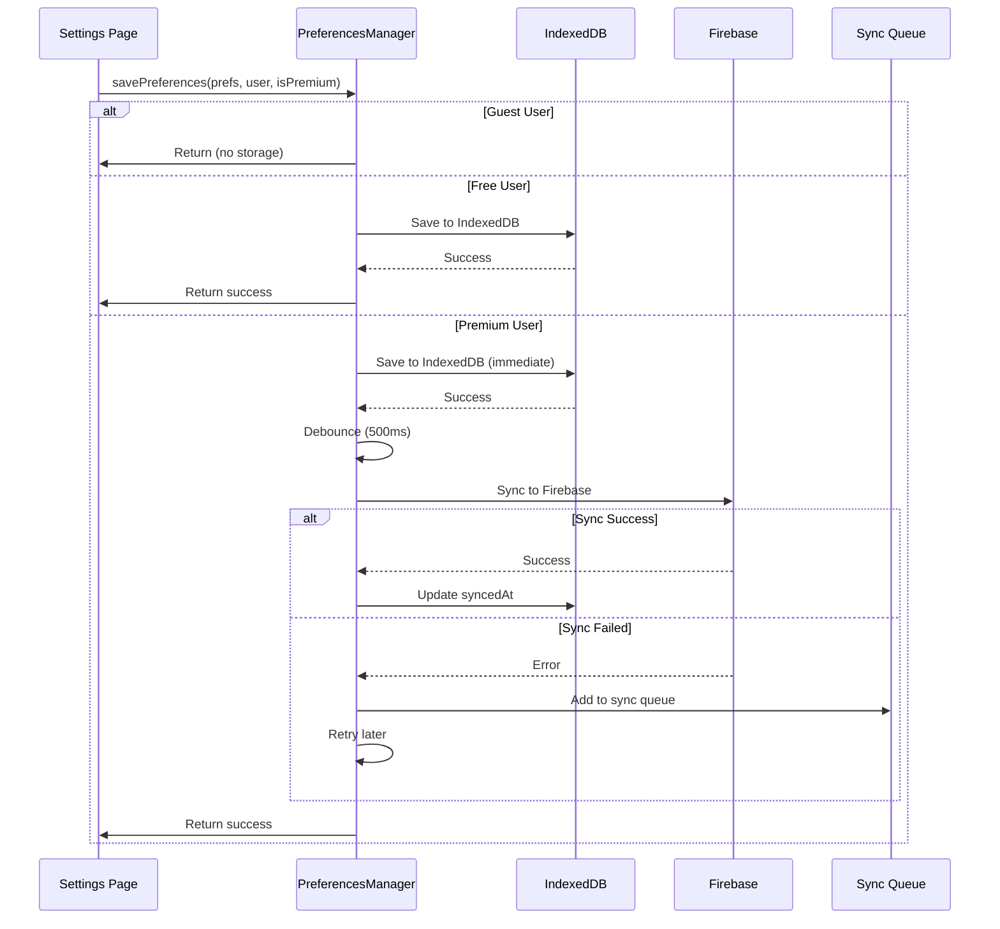

# Preferences Storage Implementation Guide

## Overview

This document details the implementation of the user preferences storage system in Moshimoshi, which follows the [Unified Storage Architecture](./UNIFIED_STORAGE_ARCHITECTURE.md). The preferences system manages all user settings including theme, language, notifications, learning preferences, privacy settings, and accessibility options.

## Table of Contents

1. [Architecture Overview](#architecture-overview)
2. [Storage Tiers & Access Rights](#storage-tiers--access-rights)
3. [Implementation Details](#implementation-details)
4. [Data Structure](#data-structure)
5. [API Reference](#api-reference)
6. [Firebase Security Rules](#firebase-security-rules)
7. [Migration Strategy](#migration-strategy)
8. [Testing Guide](#testing-guide)
9. [Troubleshooting](#troubleshooting)
10. [Future Enhancements](#future-enhancements)

---

## Architecture Overview

### System Components

```
┌─────────────────────────────────────────────────────────────┐
│                        Settings Page                         │
│                    (User Interface Layer)                    │
└─────────────────┬───────────────────────────┬───────────────┘
                  │                           │
                  ▼                           ▼
        ┌─────────────────┐         ┌─────────────────┐
        │   useAuth()     │         │ useSubscription()│
        │  (User State)   │         │ (Premium Status) │
        └────────┬────────┘         └────────┬────────┘
                 │                            │
                 └──────────┬─────────────────┘
                            ▼
               ┌────────────────────────┐
               │  PreferencesManager    │
               │   (Singleton Class)    │
               └────────────────────────┘
                            │
        ┌───────────────────┼───────────────────┐
        ▼                   ▼                   ▼
┌──────────────┐  ┌──────────────┐  ┌──────────────┐
│   Guest      │  │   Free User   │  │ Premium User │
│  (No Save)   │  │  (IndexedDB)  │  │ (IndexedDB + │
│              │  │               │  │   Firebase)  │
└──────────────┘  └──────────────┘  └──────────────┘
```

### Data Flow



---

## Storage Tiers & Access Rights

### User Classification

| User Type | Authentication | Subscription | Storage Rights | Sync Rights | Data Persistence |
|-----------|---------------|--------------|----------------|-------------|------------------|
| **Guest** | ❌ Not logged in | N/A | ❌ None | ❌ None | Session only (lost on refresh) |
| **Free** | ✅ Logged in | ❌ No subscription | ✅ IndexedDB | ❌ No sync | Device-specific |
| **Premium** | ✅ Logged in | ✅ Active subscription | ✅ IndexedDB + Firebase | ✅ Full sync | Cross-device |

### Storage Locations

#### 1. **IndexedDB** (Local Storage)
- **Database**: `moshimoshi-preferences`
- **Object Stores**:
  - `preferences`: User preference data
  - `syncQueue`: Failed sync operations for retry
- **Access**: All authenticated users (Free & Premium)
- **Persistence**: Until browser data cleared

#### 2. **Firebase Firestore** (Cloud Storage)
- **Collection Path**: `/users/{userId}/preferences/settings`
- **Access**: Premium users only
- **Sync**: Automatic with debouncing (500ms)
- **Persistence**: Permanent (until user deletion)

---

## Implementation Details

### File Structure

```
src/
├── utils/
│   └── preferencesManager.ts      # Core preferences management class
├── app/
│   └── settings/
│       └── page.tsx               # Settings UI implementation
├── hooks/
│   ├── useAuth.ts                # Authentication state
│   └── useSubscription.ts        # Premium status detection
└── lib/
    └── firebase/
        └── config.ts              # Firebase configuration

firestore.rules                   # Security rules for preferences
```

### Core Class: PreferencesManager

```typescript
// Singleton pattern implementation
export class PreferencesManager {
  private static instance: PreferencesManager;
  private db: IDBPDatabase<PreferencesDBSchema> | null = null;
  private syncTimeout: NodeJS.Timeout | null = null;
  private readonly SYNC_DELAY = 500; // Debounce delay in ms

  static getInstance(): PreferencesManager {
    if (!this.instance) {
      this.instance = new PreferencesManager();
    }
    return this.instance;
  }

  // Core public methods
  async savePreferences(preferences, user, isPremium): Promise<void>
  async getPreferences(user, isPremium): Promise<UserPreferences>
  async migrateFromLocalStorage(user, isPremium): Promise<boolean>
  async clearPreferences(userId): Promise<void>
  async forceSyncAll(userId): Promise<void>

  // Private helper methods
  private async initDB(): Promise<void>
  private async saveToIndexedDB(userId, preferences): Promise<void>
  private async getPreferencesFromIndexedDB(userId): Promise<UserPreferences>
  private queueFirebaseSync(userId, preferences): void
  private async syncToFirebase(userId, preferences): Promise<void>
  private async getPreferencesFromFirebase(userId): Promise<UserPreferences>
  private mergePreferences(local, cloud): UserPreferences
  private async addToSyncQueue(userId, preferences): Promise<void>
  private async processSyncQueue(userId): Promise<void>
}
```

### Key Features

#### 1. **Debounced Syncing**
Prevents excessive Firebase writes when users rapidly change settings:

```typescript
private queueFirebaseSync(userId: string, preferences: UserPreferences): void {
  // Clear any existing timeout
  if (this.syncTimeout) {
    clearTimeout(this.syncTimeout);
  }

  // Set new timeout for 500ms
  this.syncTimeout = setTimeout(() => {
    this.syncToFirebase(userId, preferences);
  }, this.SYNC_DELAY);
}
```

#### 2. **Offline Resilience**
Failed syncs are queued and retried:

```typescript
// Sync queue structure
interface SyncQueueItem {
  id?: number;
  userId: string;
  preferences: UserPreferences;
  timestamp: number;
  retryCount: number;
  status: 'pending' | 'syncing' | 'completed' | 'failed';
}

// Maximum 3 retry attempts
if (item.status === 'pending' && item.retryCount < 3) {
  // Retry sync operation
}
```

#### 3. **Conflict Resolution**
Uses "Last Write Wins" strategy:

```typescript
private mergePreferences(
  local: UserPreferences | null,
  cloud: UserPreferences | null
): UserPreferences {
  // Return the most recently updated version
  return local.updatedAt > cloud.updatedAt ? local : cloud;
}
```

---

## Data Structure

### UserPreferences Interface

```typescript
export interface UserPreferences {
  // Appearance Settings
  theme: 'light' | 'dark' | 'system';
  language: 'en' | 'ja' | 'fr' | 'it' | 'de' | 'es';
  palette: string; // Color scheme (e.g., 'sakura', 'ocean', 'forest')

  // Notification Preferences
  notifications: {
    dailyReminder: boolean;
    achievementAlerts: boolean;
    weeklyProgress: boolean;
    marketingEmails: boolean;
  };

  // Learning Settings
  learning: {
    autoplay: boolean;        // Auto-play audio
    furigana: boolean;        // Show furigana above kanji
    romaji: boolean;          // Show romaji translations
    soundEffects: boolean;    // UI sound effects
    hapticFeedback: boolean;  // Vibration feedback (mobile)
  };

  // Privacy Settings
  privacy: {
    publicProfile: boolean;
    showProgress: boolean;
    shareAchievements: boolean;
  };

  // Accessibility Options
  accessibility: {
    largeText: boolean;
    highContrast: boolean;
    reduceMotion: boolean;
    screenReader: boolean;
  };

  // Metadata
  updatedAt: Date;      // Last update timestamp
  syncedAt?: Date;      // Last successful sync (premium only)
}
```

### Default Values

```typescript
const DEFAULT_PREFERENCES = {
  theme: 'dark',           // Default to dark theme
  language: 'en',
  palette: 'sakura',
  notifications: {
    dailyReminder: true,
    achievementAlerts: true,
    weeklyProgress: false,
    marketingEmails: false,
  },
  learning: {
    autoplay: true,
    furigana: true,
    romaji: false,
    soundEffects: true,
    hapticFeedback: true,
  },
  privacy: {
    publicProfile: false,
    showProgress: true,
    shareAchievements: false,
  },
  accessibility: {
    largeText: false,
    highContrast: false,
    reduceMotion: false,
    screenReader: false,
  }
};
```

---

## API Reference

### Public Methods

#### `savePreferences(preferences, user, isPremium)`

Saves user preferences based on their tier.

**Parameters:**
- `preferences`: `Partial<UserPreferences>` - Preferences to save
- `user`: `User | null` - Firebase User object or null for guests
- `isPremium`: `boolean` - Premium subscription status

**Returns:** `Promise<void>`

**Example:**
```typescript
await preferencesManager.savePreferences(
  {
    theme: 'dark',
    language: 'ja',
    notifications: { dailyReminder: false }
  },
  user,
  isPremium
);
```

#### `getPreferences(user, isPremium)`

Retrieves user preferences from appropriate storage.

**Parameters:**
- `user`: `User | null` - Firebase User object or null
- `isPremium`: `boolean` - Premium subscription status

**Returns:** `Promise<UserPreferences>`

**Example:**
```typescript
const preferences = await preferencesManager.getPreferences(user, isPremium);
console.log('Current theme:', preferences.theme);
```

#### `migrateFromLocalStorage(user, isPremium)`

Migrates existing localStorage data to new storage system.

**Parameters:**
- `user`: `User` - Firebase User object
- `isPremium`: `boolean` - Premium subscription status

**Returns:** `Promise<boolean>` - Success status

**Example:**
```typescript
const migrated = await preferencesManager.migrateFromLocalStorage(user, isPremium);
if (migrated) {
  console.log('Successfully migrated old preferences');
}
```

#### `clearPreferences(userId)`

Clears all preferences for a user (useful for logout/testing).

**Parameters:**
- `userId`: `string` - User ID to clear

**Returns:** `Promise<void>`

#### `forceSyncAll(userId)`

Forces immediate sync of all pending items in queue.

**Parameters:**
- `userId`: `string` - User ID

**Returns:** `Promise<void>`

---

## Firebase Security Rules

```javascript
// Location: /firestore.rules

// User preferences collection - structured under users collection
match /users/{userId}/preferences/{document} {
  // Only the user can read their own preferences
  allow read: if request.auth != null
    && request.auth.uid == userId;

  // User can create preferences if authenticated and it's their own data
  allow create: if request.auth != null
    && request.auth.uid == userId
    && request.resource.data.userId == userId
    && request.resource.data.keys().hasAll(['userId', 'updatedAt']);

  // User can update their own preferences
  allow update: if request.auth != null
    && request.auth.uid == userId
    && request.resource.data.userId == userId
    && request.resource.data.userId == resource.data.userId;

  // Preferences should not be deleted (only updated)
  allow delete: if false;
}
```

### Security Principles

1. **Authentication Required**: All operations require authenticated user
2. **Owner-Only Access**: Users can only read/write their own preferences
3. **No Deletion**: Preferences can be updated but not deleted
4. **Data Validation**: Required fields must be present
5. **User ID Verification**: Client-provided userId must match auth token

---

## Migration Strategy

### From localStorage to New System

The system automatically migrates existing localStorage data on first load:

```typescript
// Migration flow
1. Check for migration flag: `preferences-migrated-${userId}`
2. If not migrated:
   a. Read old data from localStorage key: 'user-preferences'
   b. Transform to new UserPreferences format
   c. Save using PreferencesManager
   d. Set migration flag
3. Keep original data (don't delete) for safety
```

### Migration Code Example

```typescript
// In Settings page component
useEffect(() => {
  const migrate = async () => {
    if (user) {
      const migrated = await preferencesManager.migrateFromLocalStorage(
        user,
        isPremium
      );

      if (migrated) {
        console.log('Preferences migrated successfully');
      }
    }
  };

  migrate();
}, [user, isPremium]);
```

---

## Testing Guide

### Testing Different User Tiers

#### 1. **Guest User Testing**
```typescript
// Test with no authentication
await auth.signOut();

// Verify:
// - Settings show but don't persist
// - Refresh loses all changes
// - UI shows "Guest Mode" indicator
```

#### 2. **Free User Testing**
```typescript
// Sign in as free user
await auth.signInWithEmail(freeUserEmail, password);

// Verify:
// - Settings save to IndexedDB
// - Settings persist after refresh
// - Settings don't sync to other devices
// - UI shows "Free Account" indicator
```

#### 3. **Premium User Testing**
```typescript
// Sign in as premium user
await auth.signInWithEmail(premiumUserEmail, password);

// Verify:
// - Settings save to IndexedDB immediately
// - Settings sync to Firebase (check Firestore console)
// - Settings sync across devices
// - UI shows "Premium" indicator
```

### Browser DevTools Testing

#### Check IndexedDB Storage
```javascript
// In browser console
// 1. Open DevTools → Application → IndexedDB
// 2. Find 'moshimoshi-preferences' database
// 3. Check 'preferences' and 'syncQueue' stores
```

#### Enable Debug Logging
```javascript
// In browser console
localStorage.setItem('debug:preferences', 'true');

// Now all PreferencesManager operations will log to console
```

#### Force Sync Failure (Testing Resilience)
```javascript
// Temporarily block Firebase domain in DevTools Network tab
// Make preference changes
// Check that changes are queued in syncQueue
// Unblock domain - verify sync completes
```

### Automated Test Suite

```typescript
describe('PreferencesManager', () => {
  it('should return defaults for guest users', async () => {
    const prefs = await preferencesManager.getPreferences(null, false);
    expect(prefs.theme).toBe('dark'); // Default theme
  });

  it('should save to IndexedDB for free users', async () => {
    const user = { uid: 'test-user' };
    await preferencesManager.savePreferences(
      { theme: 'light' },
      user,
      false // not premium
    );

    const saved = await preferencesManager.getPreferences(user, false);
    expect(saved.theme).toBe('light');
  });

  it('should sync to Firebase for premium users', async () => {
    const user = { uid: 'premium-user' };
    await preferencesManager.savePreferences(
      { theme: 'light' },
      user,
      true // premium
    );

    // Wait for debounce
    await new Promise(resolve => setTimeout(resolve, 600));

    // Verify Firebase write occurred
    const cloudPrefs = await getDoc(doc(db, 'users', user.uid, 'preferences', 'settings'));
    expect(cloudPrefs.data().theme).toBe('light');
  });
});
```

---

## Troubleshooting

### Common Issues & Solutions

#### 1. **Preferences Not Saving**

**Symptoms:**
- Changes lost on refresh
- Save button doesn't work

**Solutions:**
```typescript
// Check authentication status
console.log('User:', user);
console.log('Is Premium:', isPremium);

// Check IndexedDB availability
if (!window.indexedDB) {
  console.error('IndexedDB not supported');
}

// Check for private browsing mode
try {
  await openDB('test');
} catch (e) {
  console.error('IndexedDB blocked (private mode?)');
}
```

#### 2. **Firebase Sync Failing**

**Symptoms:**
- Premium user but no cross-device sync
- Console errors about Firebase

**Solutions:**
```typescript
// Check Firebase configuration
console.log('Firebase app:', app);
console.log('Firestore:', db);

// Check network connectivity
console.log('Online:', navigator.onLine);

// Check Firebase rules deployment
// Run: firebase deploy --only firestore:rules

// Check sync queue for pending items
const queue = await preferencesManager.getSyncQueueStatus(userId);
console.log('Pending syncs:', queue);
```

#### 3. **Migration Not Working**

**Symptoms:**
- Old settings not appearing
- Migration flag issues

**Solutions:**
```typescript
// Clear migration flag to retry
localStorage.removeItem(`preferences-migrated-${userId}`);

// Manually check old data
const oldData = localStorage.getItem('user-preferences');
console.log('Old preferences:', oldData);

// Force migration
await preferencesManager.migrateFromLocalStorage(user, isPremium);
```

#### 4. **Performance Issues**

**Symptoms:**
- Slow save operations
- UI freezing

**Solutions:**
```typescript
// Check sync queue size
// Large queue might indicate sync problems

// Implement batching for bulk updates
const updates = [];
// Collect multiple changes...
await preferencesManager.savePreferencesBatch(updates);

// Clear old sync queue items
await preferencesManager.clearOldSyncItems(30); // days
```

### Debug Mode

Enable comprehensive logging:

```javascript
// In browser console
localStorage.setItem('debug:preferences', 'true');
localStorage.setItem('debug:firebase', 'true');
localStorage.setItem('debug:indexeddb', 'true');

// View all storage operations in console
```

---

## Future Enhancements

### Planned Features

#### 1. **Preference Profiles**
```typescript
interface PreferenceProfile {
  name: string;           // "Work", "Home", "Study"
  preferences: UserPreferences;
  isActive: boolean;
}

// Quick switch between profiles
await preferencesManager.switchProfile('Study');
```

#### 2. **Preference History**
```typescript
interface PreferenceHistory {
  timestamp: Date;
  changes: Partial<UserPreferences>;
  device: string;
}

// Track preference changes over time
const history = await preferencesManager.getHistory(userId, days: 30);
```

#### 3. **Export/Import**
```typescript
// Export preferences to JSON
const exportData = await preferencesManager.exportPreferences(userId);

// Import from file
await preferencesManager.importPreferences(jsonData);
```

#### 4. **A/B Testing Integration**
```typescript
interface ExperimentalPreferences {
  experiments: {
    [key: string]: {
      variant: string;
      enrolledAt: Date;
    };
  };
}
```

#### 5. **Preference Templates**
```typescript
// Predefined templates for common use cases
const templates = {
  'beginner-friendly': { /* ... */ },
  'speed-learner': { /* ... */ },
  'accessibility-focused': { /* ... */ }
};

await preferencesManager.applyTemplate('beginner-friendly');
```

### Performance Optimizations

1. **Compression**: Compress preferences before storage
2. **Partial Sync**: Only sync changed fields
3. **Batch Operations**: Group multiple changes
4. **Cache Layer**: Memory cache for frequent reads
5. **Web Workers**: Move heavy operations off main thread

---

## Related Documentation

- [Unified Storage Architecture](./UNIFIED_STORAGE_ARCHITECTURE.md) - Overall storage system design
- [Firebase Setup Guide](/docs/FIREBASE_SETUP.md) - Firebase configuration
- [Subscription System](/docs/STRIPE_INTEGRATION.md) - Premium tier detection
- [Authentication Guide](/docs/AUTH_SYSTEM.md) - User authentication flow

---

## Changelog

### Version 1.0.0 (January 2025)
- Initial implementation
- Three-tier storage system
- Automatic migration from localStorage
- Debounced Firebase sync
- Offline resilience with sync queue
- Dark theme as default

---

*Last Updated: January 2025*
*Maintainer: Moshimoshi Development Team*
*Status: Production Ready*