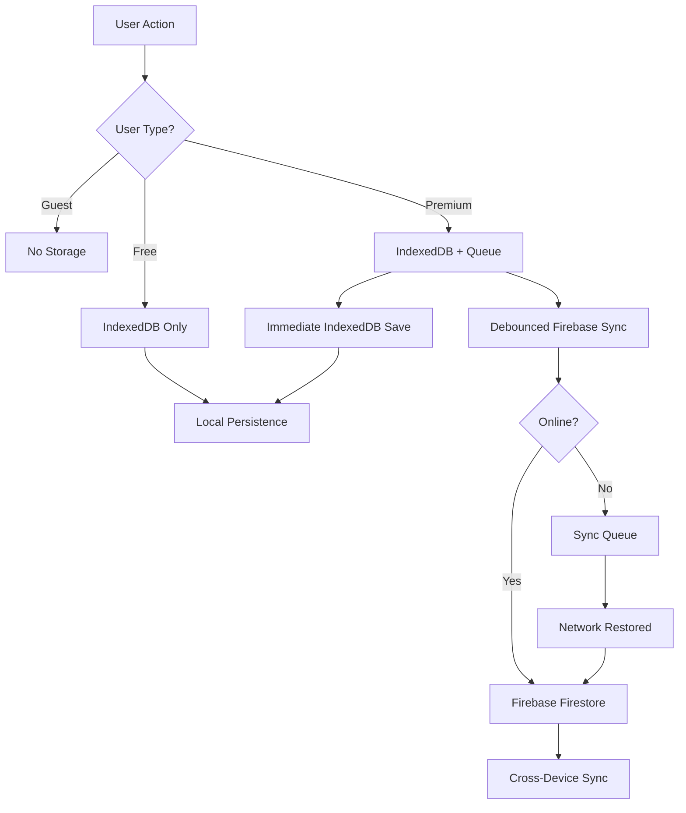

# Unified Storage Architecture

## Overview

The Moshimoshi platform implements a sophisticated three-tier storage architecture that automatically adapts based on user authentication status and subscription level. This document describes the storage system implementation and provides guidelines for extending it to new features.

## Table of Contents

1. [Storage Tiers](#storage-tiers)
2. [Architecture Components](#architecture-components)
3. [Implementation Example: Kana Progress](#implementation-example-kana-progress)
4. [Adding New Features](#adding-new-features)
5. [API Reference](#api-reference)
6. [Best Practices](#best-practices)
7. [Troubleshooting](#troubleshooting)

---

## Storage Tiers

### User Types & Storage Strategy

| User Type | Authentication | Storage Location | Sync | Data Persistence |
|-----------|---------------|------------------|------|------------------|
| **Guest** | ❌ Not logged in | None | ❌ | Session only (lost on refresh) |
| **Free** | ✅ Logged in | IndexedDB | ❌ | Device-specific |
| **Premium** | ✅ Logged in + Active subscription | IndexedDB + Firebase | ✅ | Cross-device |

### Storage Flow Diagram



---

## Architecture Components

### 1. Progress Manager Pattern

Each feature should implement its own manager class following this pattern:

```typescript
class FeatureProgressManager {
  private static instance: FeatureProgressManager;
  private db: IDBPDatabase<Schema> | null = null;
  private syncQueue: Map<string, any> = new Map();

  // Singleton pattern
  static getInstance(): FeatureProgressManager {
    if (!this.instance) {
      this.instance = new FeatureProgressManager();
    }
    return this.instance;
  }

  // Core methods
  async saveProgress(data, user, isPremium): Promise<void>
  async getProgress(user, isPremium): Promise<Data>
  async syncToFirebase(userId, data): Promise<void>
  async migrateFromLocalStorage(user, isPremium): Promise<boolean>
}
```

### 2. IndexedDB Schema

Each feature gets its own object store:

```typescript
interface ProgressDBSchema extends DBSchema {
  featureProgress: {
    key: number;
    value: {
      id?: number;
      userId: string;
      itemId: string;
      data: any;
      updatedAt: Date;
    };
    indexes: {
      'by-user': string;
      'by-updated': Date;
      'by-composite': [string, string]; // [userId, itemId]
    };
  };
}
```

### 3. Firebase Structure

Standardized collection hierarchy:

```
users/
  {userId}/
    progress/
      {feature}/
        {documentId}: {
          userId: string
          data: Record<string, any>
          totalCount: number
          lastSync: Timestamp
          updatedAt: Timestamp
        }
```

### 4. Sync Queue System

Failed Firebase syncs are queued for retry:

```typescript
interface SyncQueueItem {
  id?: number;
  type: 'progress-update';
  feature: string;
  userId: string;
  data: any;
  timestamp: number;
  retryCount: number;
  status: 'pending' | 'syncing' | 'completed' | 'failed';
}
```

---

## Implementation Example: Kana Progress

### File Structure

```
src/
  utils/
    kanaProgressManager.ts     # Manager implementation
  components/
    learn/
      KanaLearningComponent.tsx # Component integration
  hooks/
    useSubscription.ts          # Premium status detection
```

### Usage in Component

```typescript
import { kanaProgressManager } from '@/utils/kanaProgressManager';
import { useSubscription } from '@/hooks/useSubscription';
import { useAuth } from '@/hooks/useAuth';

function LearningComponent() {
  const { user } = useAuth();
  const { isPremium } = useSubscription();

  // Load progress on mount
  useEffect(() => {
    const loadProgress = async () => {
      if (!user) {
        setProgress({}); // Guest: no storage
        return;
      }

      // Migrate old data if needed
      await kanaProgressManager.migrateFromLocalStorage(
        'hiragana',
        user,
        isPremium
      );

      // Load from appropriate storage
      const data = await kanaProgressManager.getProgress(
        'hiragana',
        user,
        isPremium
      );

      setProgress(data);
    };

    loadProgress();
  }, [user, isPremium]);

  // Save progress updates
  const updateProgress = async (charId, update) => {
    if (!user) return; // Guest: no save

    await kanaProgressManager.saveProgress(
      'hiragana',
      charId,
      update,
      user,
      isPremium
    );
  };
}
```

---

## Adding New Features

### Step-by-Step Guide

#### 1. Create Your Progress Manager

Create `/src/utils/{feature}ProgressManager.ts`:

```typescript
import { openDB, DBSchema, IDBPDatabase } from 'idb';
import { doc, getDoc, setDoc, serverTimestamp } from 'firebase/firestore';
import { firestore as db } from '@/lib/firebase/client';
import { User } from 'firebase/auth';
import { reviewLogger } from '@/lib/monitoring/logger';

// Define your progress interface
export interface FeatureProgress {
  // Your progress fields
  completed: boolean;
  score: number;
  attempts: number;
  updatedAt: Date;
}

// Define IndexedDB schema
interface FeatureDBSchema extends DBSchema {
  featureProgress: {
    key: number;
    value: {
      id?: number;
      userId: string;
      itemId: string;
      progress: FeatureProgress;
    };
    indexes: {
      'by-user': string;
      'by-composite': [string, string];
    };
  };
}

export class FeatureProgressManager {
  private static instance: FeatureProgressManager;
  private db: IDBPDatabase<FeatureDBSchema> | null = null;

  static getInstance(): FeatureProgressManager {
    if (!this.instance) {
      this.instance = new FeatureProgressManager();
    }
    return this.instance;
  }

  // Implement required methods...
}

export const featureProgressManager = FeatureProgressManager.getInstance();
```

#### 2. Add IndexedDB Store

In your manager's `initDB` method:

```typescript
private async initDB(): Promise<void> {
  this.db = await openDB<FeatureDBSchema>('moshimoshi-progress', 2, {
    upgrade(db, oldVersion, newVersion) {
      // Add your store
      if (!db.objectStoreNames.contains('featureProgress')) {
        const store = db.createObjectStore('featureProgress', {
          keyPath: 'id',
          autoIncrement: true
        });
        store.createIndex('by-user', 'userId');
        store.createIndex('by-composite', ['userId', 'itemId'], {
          unique: true
        });
      }
    }
  });
}
```

#### 3. Implement Core Methods

```typescript
async saveProgress(
  itemId: string,
  progress: FeatureProgress,
  user: User | null,
  isPremium: boolean
): Promise<void> {
  // Guest users: no storage
  if (!user) return;

  // Save to IndexedDB (all logged-in users)
  await this.saveToIndexedDB(user.uid, itemId, progress);

  // Premium users: also sync to Firebase
  if (isPremium) {
    this.queueFirebaseSync(user.uid, itemId, progress);
  }
}

async getProgress(
  user: User | null,
  isPremium: boolean
): Promise<Record<string, FeatureProgress>> {
  // Guest users: return empty
  if (!user) return {};

  // Load from IndexedDB
  const local = await this.loadFromIndexedDB(user.uid);

  // Premium users: merge with Firebase
  if (isPremium && navigator.onLine) {
    try {
      const cloud = await this.loadFromFirebase(user.uid);
      return this.mergeProgress(local, cloud);
    } catch (error) {
      // Fallback to local on error
      return local;
    }
  }

  return local;
}
```

#### 4. Add Firebase Security Rules

Add to `/firestore.rules`:

```javascript
match /users/{userId}/progress/{feature} {
  allow read: if request.auth != null
    && request.auth.uid == userId;

  allow write: if request.auth != null
    && request.auth.uid == userId
    && request.resource.data.userId == userId;

  allow delete: if false; // Prevent deletion
}
```

#### 5. Integrate in Your Component

```typescript
import { featureProgressManager } from '@/utils/featureProgressManager';
import { useSubscription } from '@/hooks/useSubscription';
import { useAuth } from '@/hooks/useAuth';

export function FeatureComponent() {
  const { user } = useAuth();
  const { isPremium } = useSubscription();
  const [progress, setProgress] = useState({});

  // Load on mount
  useEffect(() => {
    const load = async () => {
      const data = await featureProgressManager.getProgress(
        user,
        isPremium
      );
      setProgress(data);
    };
    load();
  }, [user, isPremium]);

  // Save updates
  const updateItem = async (itemId, update) => {
    await featureProgressManager.saveProgress(
      itemId,
      update,
      user,
      isPremium
    );
  };
}
```

---

## API Reference

### Core Manager Methods

#### `saveProgress(itemId, progress, user, isPremium)`
Saves progress for a specific item.

**Parameters:**
- `itemId`: Unique identifier for the item
- `progress`: Progress data object
- `user`: Firebase User object or null
- `isPremium`: Boolean indicating premium status

**Returns:** `Promise<void>`

#### `getProgress(user, isPremium)`
Retrieves all progress for the user.

**Parameters:**
- `user`: Firebase User object or null
- `isPremium`: Boolean indicating premium status

**Returns:** `Promise<Record<string, Progress>>`

#### `migrateFromLocalStorage(key, user, isPremium)`
Migrates existing localStorage data to new storage.

**Parameters:**
- `key`: localStorage key to migrate from
- `user`: Firebase User object
- `isPremium`: Boolean indicating premium status

**Returns:** `Promise<boolean>` - Success status

#### `clearProgress(userId)`
Clears all progress for a user (testing/cleanup).

**Parameters:**
- `userId`: User ID to clear

**Returns:** `Promise<void>`

### Utility Hooks

#### `useSubscription()`
Returns subscription status and helper methods.

```typescript
const {
  isPremium,      // boolean
  isFreeTier,     // boolean
  subscription,   // SubscriptionFacts | null
  isLoading      // boolean
} = useSubscription();
```

#### `useAuth()`
Returns current user authentication state.

```typescript
const {
  user,          // User | null
  isLoading,     // boolean
  error         // Error | null
} = useAuth();
```

---

## Best Practices

### 1. Debouncing Updates

Prevent excessive Firebase writes:

```typescript
private syncTimeout: NodeJS.Timeout | null = null;
private readonly SYNC_DELAY = 500; // ms

private queueFirebaseSync(userId: string, data: any) {
  if (this.syncTimeout) {
    clearTimeout(this.syncTimeout);
  }

  this.syncTimeout = setTimeout(() => {
    this.syncToFirebase(userId, data);
  }, this.SYNC_DELAY);
}
```

### 2. Conflict Resolution

Use "Last Write Wins" with special cases:

```typescript
private mergeProgress(local: Data, cloud: Data): Data {
  const merged = { ...local };

  for (const [id, cloudItem] of Object.entries(cloud)) {
    const localItem = local[id];

    if (!localItem || cloudItem.updatedAt > localItem.updatedAt) {
      merged[id] = cloudItem;
    }

    // Special case: preserve important flags
    if (cloudItem.pinned && !localItem.pinned) {
      merged[id] = { ...localItem, pinned: true };
    }
  }

  return merged;
}
```

### 3. Error Handling

Always provide fallbacks:

```typescript
try {
  const cloud = await this.loadFromFirebase(userId);
  return this.mergeProgress(local, cloud);
} catch (error) {
  reviewLogger.error('Firebase load failed:', error);
  // Fallback to local data
  return local;
}
```

### 4. Migration Strategy

Preserve old data during migration:

```typescript
async migrateFromLocalStorage(key: string, user: User, isPremium: boolean) {
  const migrationFlag = `${key}-migrated`;

  // Check if already migrated
  if (localStorage.getItem(migrationFlag)) {
    return false;
  }

  const oldData = localStorage.getItem(key);
  if (!oldData) return false;

  try {
    const parsed = JSON.parse(oldData);
    // Migrate data...

    // Mark as migrated (don't delete original yet)
    localStorage.setItem(migrationFlag, 'true');
    return true;
  } catch (error) {
    return false;
  }
}
```

### 5. Performance Optimization

Batch operations when possible:

```typescript
// Bad: Individual saves
for (const item of items) {
  await saveProgress(item.id, item.data);
}

// Good: Batch save
await saveProgressBatch(items);
```

---

## Troubleshooting

### Common Issues

#### 1. IndexedDB Not Available

**Symptom:** Storage not working in private browsing
**Solution:** Detect and fallback to memory storage

```typescript
if (!window.indexedDB) {
  console.warn('IndexedDB not available');
  // Use in-memory storage
}
```

#### 2. Firebase Quota Exceeded

**Symptom:** 429 errors from Firebase
**Solution:** Implement rate limiting

```typescript
const RATE_LIMIT = 10; // operations per second
const queue = new RateLimitedQueue(RATE_LIMIT);
```

#### 3. Sync Conflicts

**Symptom:** Data inconsistency between devices
**Solution:** Add version numbers

```typescript
interface VersionedProgress {
  version: number;
  data: any;
  updatedAt: Date;
}
```

#### 4. Migration Failures

**Symptom:** Old data not appearing
**Solution:** Retry migration on next load

```typescript
const MAX_MIGRATION_ATTEMPTS = 3;
let attempts = parseInt(localStorage.getItem(`${key}-attempts`) || '0');

if (attempts < MAX_MIGRATION_ATTEMPTS) {
  // Try migration again
}
```

### Debug Logging

Enable verbose logging:

```typescript
// In browser console
localStorage.setItem('debug:storage', 'true');

// In your manager
if (localStorage.getItem('debug:storage')) {
  console.log('[Storage]', operation, data);
}
```

### Testing Different User Types

```typescript
// Test as guest (logged out)
await auth.signOut();

// Test as free user
await auth.signInWithEmail(freeUser);

// Test as premium user
await auth.signInWithEmail(premiumUser);
```

---

## Security Considerations

### 1. Data Validation

Always validate data before storage:

```typescript
function validateProgress(data: any): boolean {
  return (
    typeof data.score === 'number' &&
    data.score >= 0 &&
    data.score <= 100 &&
    data.updatedAt instanceof Date
  );
}
```

### 2. User ID Verification

Never trust client-provided user IDs:

```typescript
// Bad
const userId = request.body.userId;

// Good
const userId = request.auth.uid; // From Firebase Auth
```

### 3. Rate Limiting

Prevent abuse:

```typescript
const userLimits = new Map<string, number>();

function checkRateLimit(userId: string): boolean {
  const count = userLimits.get(userId) || 0;
  if (count > MAX_OPERATIONS_PER_MINUTE) {
    return false;
  }
  userLimits.set(userId, count + 1);
  return true;
}
```

---

## Future Enhancements

### Planned Features

1. **Bulk Operations API**
   - Batch save/load for performance
   - Transaction support

2. **Versioning System**
   - Schema migrations
   - Backward compatibility

3. **Analytics Integration**
   - Progress tracking metrics
   - Usage patterns

4. **Export/Import**
   - User data portability
   - GDPR compliance

5. **Compression**
   - Reduce storage size
   - Optimize sync bandwidth

### Contributing

To add a new storage feature:

1. Follow the patterns in this document
2. Add tests for all user types
3. Update this documentation
4. Submit PR with migration plan

---

## Related Documentation

- [Review Engine Architecture](/docs/universal-review-engine/REVIEW_ENGINE_DEEP_DIVE.md)
- [Firebase Setup Guide](/docs/FIREBASE_SETUP.md)
- [Subscription System](/docs/STRIPE_INTEGRATION.md)
- [Security Best Practices](/docs/SECURITY.md)

---

*Last Updated: January 2025*
*Version: 1.0.0*