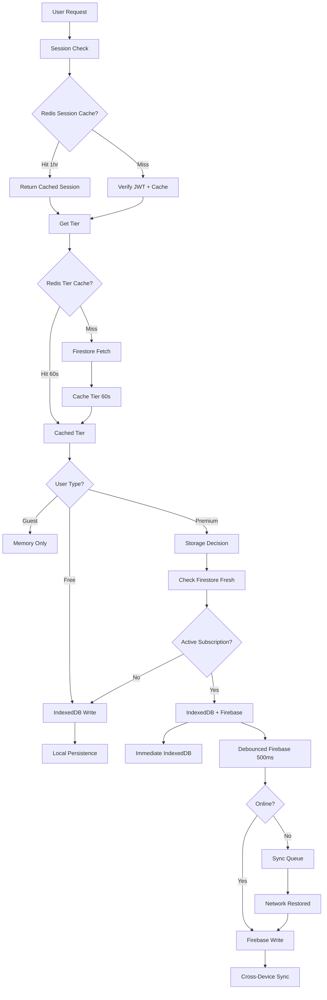

# Unified Storage Architecture

## Overview

The Moshimoshi platform implements a sophisticated **four-tier storage architecture** that automatically adapts based on user authentication status and subscription level. This includes Redis caching, IndexedDB local persistence, Firebase cloud sync, and in-memory session state. This document describes the complete storage system implementation and provides guidelines for extending it to new features.

## Table of Contents

1. [Storage Tiers](#storage-tiers)
2. [Redis Caching Layer](#redis-caching-layer)
3. [Architecture Components](#architecture-components)
4. [Premium User Detection](#premium-user-detection)
5. [Implementation Example: Kana Progress](#implementation-example-kana-progress)
6. [Adding New Features](#adding-new-features)
7. [API Reference](#api-reference)
8. [Best Practices](#best-practices)
9. [Performance Characteristics](#performance-characteristics)
10. [Troubleshooting](#troubleshooting)
11. [Known Issues & Recommendations](#known-issues--recommendations)

---

## Storage Tiers

### Complete Storage Architecture

The platform uses **4 storage layers** working together:

1. **Redis** (Upstash) - Session management, tier caching, statistics
2. **IndexedDB** - Local persistence for authenticated users
3. **Firebase Firestore** - Cloud sync for premium users only
4. **Memory** - Temporary session state for guest users

### User Types & Storage Strategy

| User Type | Memory | Redis Cache | IndexedDB | Firebase | Cross-Device Sync |
|-----------|--------|-------------|-----------|----------|-------------------|
| **Guest** | ✅ Session only | ❌ | ❌ | ❌ | ❌ |
| **Free** | ✅ Session state | ✅ Session + Stats | ✅ All data | ❌ | ❌ |
| **Premium** | ✅ Session state | ✅ Session + Stats + Tier | ✅ All data (cache) | ✅ Cloud backup | ✅ |

### Complete Storage Flow Diagram


```mermaid
graph TD
    A[User Request] --> B[Session Check]
    B --> C{Redis Session Cache?}
    C -->|Hit 1hr| D[Return Cached Session]
    C -->|Miss| E[Verify JWT + Cache]

    D --> F[Get Tier]
    E --> F

    F --> G{Redis Tier Cache?}
    G -->|Hit 60s| H[Cached Tier]
    G -->|Miss| I[Firestore Fetch]
    I --> J[Cache Tier 60s]
    J --> H

    H --> K{User Type?}
    K -->|Guest| L[Memory Only]
    K -->|Free| M[IndexedDB Write]
    K -->|Premium| N[Storage Decision]

    N --> O[Check Firestore Fresh]
    O --> P{Active Subscription?}
    P -->|Yes| Q[IndexedDB + Firebase]
    P -->|No| M

    M --> R[Local Persistence]
    Q --> S[Immediate IndexedDB]
    Q --> T[Debounced Firebase 500ms]

    T --> U{Online?}
    U -->|Yes| V[Firebase Write]
    U -->|No| W[Sync Queue]

    W --> X[Network Restored]
    X --> V

    V --> Y[Cross-Device Sync]
```

---

## Redis Caching Layer

### Overview

Redis (Upstash) provides high-performance caching for session management, tier lookups, and statistics. All authenticated users benefit from Redis caching regardless of subscription tier.

**Provider:** Upstash Redis (Serverless, REST-based)
**Location:** `src/lib/redis/client.ts`
**Fallback:** Mock implementation in development

### Redis Data Types

#### 1. Session Management

| Key Pattern | TTL | Data Structure | Purpose |
|-------------|-----|----------------|---------|
| `session:{sessionId}` | 1 hour | JSON | JWT validation cache |
| `blacklist:{sessionId}` | Remaining JWT TTL | String | Revoked sessions |
| `user_sessions:{userId}` | Persistent | Set | Active session tracking |

**Session Cache Structure:**
```typescript
{
  uid: string
  tier?: 'free' | 'premium_monthly' | 'premium_yearly'
  valid: boolean
  fingerprint: string  // User agent + IP hash
  needsTierRefresh?: boolean
}
```

**Performance:** 5-10ms vs 100-200ms Firestore (20x faster)

#### 2. Tier Caching ⚠️ CRITICAL FOR PREMIUM

| Key | TTL | Data | File Reference |
|-----|-----|------|----------------|
| `tier:{userId}` | **60 seconds** | String | `src/lib/auth/tier-cache.ts` |

**Tier Cache Flow:**
```typescript
getTierForSession(userId) {
  1. Check Redis cache (tier:{userId})
     ↓ Cache Hit (90% of requests)
  2. Return cached tier
     ↓ Cache Miss
  3. Fetch from Firestore users/{uid}/subscription
  4. Determine tier from subscription.status + subscription.plan
  5. Cache in Redis for 60 seconds
  6. Return tier
}
```

**Invalidation Triggers:**
- Stripe webhook subscription update → `tierCache.invalidate(userId)`
- Manual admin tier changes
- User subscription cancellation

**⚠️ Important:** Storage decisions bypass tier cache and always fetch fresh from Firestore for security.

#### 3. Statistics Caching (All Users)

| Cache Type | Key Pattern | TTL | Fields |
|------------|-------------|-----|--------|
| **User Stats** | `stats:{userId}` | 1 hour | 20+ fields (hash) |
| **Streak** | `streak:{userId}` | 30 min | current, best, lastReview |
| **Progress** | `progress:{userId}` | 15 min | new, learning, mastered, dueToday |
| **Review Queue** | `queue:{userId}` | 30 min | Prioritized review items |

**Stats Hash Structure:**
```typescript
{
  totalPinned: "42"
  newItems: "15"
  learningItems: "10"
  masteredItems: "17"
  dueToday: "8"
  streak: "7"
  bestStreak: "14"
  accuracy7d: "85.5"
  accuracy30d: "82.3"
  accuracyAllTime: "84.1"
  totalReviews: "1250"
  reviewsToday: "12"
  reviewsThisWeek: "84"
  reviewsThisMonth: "342"
  totalTimeSpent: "18240"  // seconds
  // ... more fields
}
```

**Performance:** Hash operations ~5-10ms, prevents expensive Firestore aggregations

#### 4. Rate Limiting

| Key Pattern | TTL | Purpose |
|-------------|-----|---------|
| `ratelimit:{endpoint}:{identifier}` | 60s | Per-minute request limits |
| `auth_attempts:{identifier}` | 15min | Failed login tracking |

**Implementation:**
```typescript
async checkRateLimit(userId, endpoint) {
  const key = `ratelimit:${endpoint}:${userId}`
  const count = await redis.incr(key)
  if (count === 1) await redis.expire(key, 60)
  return count <= MAX_REQUESTS_PER_MINUTE
}
```

### Cache Warming

**Strategy:** Pre-load frequently accessed data
**File:** `src/lib/redis/warming/warmer.ts`

**Warm-up Triggers:**
- User login → Warm session + tier + stats
- Dashboard load → Warm queue + sets
- Scheduled (nightly) → Tomorrow's review queues
- Premium users prioritized

**Batch Warmup:**
```typescript
await cacheWarmer.batchWarmUsers(userIds, parallelism: 5)
```

### Redis Key Patterns

```typescript
// Session & Auth
session:{sessionId}           // JWT validation cache
blacklist:{sessionId}         // Revoked sessions
tier:{userId}                 // User tier cache
user_sessions:{userId}        // Active sessions set

// User Data
stats:{userId}                // Statistics hash
streak:{userId}               // Streak data
progress:{userId}             // Progress summary
queue:{userId}                // Review queue

// Rate Limiting
ratelimit:{endpoint}:{id}     // Request counters
auth_attempts:{email}         // Login attempts

// Review Engine
sets:{userId}                 // Study sets
content:{type}:{id}           // Content cache
leaderboard:{metric}:{period} // Leaderboard data
```

### Redis Performance Metrics

| Operation | Latency | Cache Hit Rate | Cost Savings |
|-----------|---------|----------------|--------------|
| Session validation | 5-10ms | 95% | ~1M Firestore reads/day |
| Tier lookup | 5-10ms | 90% | ~500K Firestore reads/day |
| Stats retrieval | 10-15ms | 80% | Prevents expensive aggregations |
| Rate limit check | 5ms | 100% | N/A |

**Monthly Cost:** ~$10 Upstash → **Saves ~$500/month** in Firestore reads

---

## Premium User Detection

### Three-Layer Detection System

**1. Client-Side Hook** (`useSubscription.ts`)
```typescript
const { isPremium } = useSubscription()
// Fetches from /api/user/subscription
// Polls after checkout: immediate, 2s, 5s, 10s
```

**2. Server-Side Tier Cache** (`tier-cache.ts`)
```typescript
const tier = await tierCache.getUserTier(userId)
// 60-second Redis cache
// Fallback to Firestore on miss
```

**3. Storage Decision (Critical Path)** (`storage-helper.ts`)
```typescript
const decision = await getStorageDecision(session)
// ALWAYS fetches fresh from Firestore
// Bypasses tier cache for security
// Returns: { shouldWriteToFirebase, storageLocation, isPremium }
```

### Why Three Different Sources?

| Source | TTL | Use Case | Priority |
|--------|-----|----------|----------|
| **Client Hook** | Session | UI display, feature access | Low |
| **Tier Cache** | 60s | Fast tier lookups | Medium |
| **Storage Decision** | Real-time | Firebase write authorization | **CRITICAL** |

**Trade-off:** Storage decisions are 100% accurate but cost ~100ms per request. Tier cache is 90% accurate but only ~10ms.

### Premium Detection Flow

```typescript
// Example: Saving a todo
1. Client calls POST /api/todos
2. Server: requireAuth() → Get session
3. Server: getStorageDecision(session)
   → Fetch fresh from Firestore users/{uid}/subscription
   → Check: status === 'active' && (plan === 'premium_monthly' || 'premium_yearly')
4. If premium:
     Write to IndexedDB (client-side)
     Write to Firebase (server-side)
   Else:
     Write to IndexedDB only (client-side)
     Skip Firebase write
5. Return: { data, storage: { location: 'both' | 'local' } }
6. Client: Uses storage.location to determine sync strategy
```

### Valid Premium Plans

```typescript
const PREMIUM_PLANS = ['premium_monthly', 'premium_yearly']
// Any other plan (including 'free', null, undefined) = Free tier
```

**Important:** No `premium_lifetime`, `premium_annual`, or other variants. Only the two above.

---

## Architecture Components

### 1. Progress Manager Pattern

Each feature should implement its own manager class following this pattern:

```typescript
class FeatureProgressManager {
  private static instance: FeatureProgressManager;
  private db: IDBPDatabase<Schema> | null = null;
  private syncQueue: Map<string, any> = new Map();

  // Singleton pattern
  static getInstance(): FeatureProgressManager {
    if (!this.instance) {
      this.instance = new FeatureProgressManager();
    }
    return this.instance;
  }

  // Core methods
  async saveProgress(data, user, isPremium): Promise<void>
  async getProgress(user, isPremium): Promise<Data>
  async syncToFirebase(userId, data): Promise<void>
  async migrateFromLocalStorage(user, isPremium): Promise<boolean>
}
```

### 2. IndexedDB Schema

Each feature gets its own object store:

```typescript
interface ProgressDBSchema extends DBSchema {
  featureProgress: {
    key: number;
    value: {
      id?: number;
      userId: string;
      itemId: string;
      data: any;
      updatedAt: Date;
    };
    indexes: {
      'by-user': string;
      'by-updated': Date;
      'by-composite': [string, string]; // [userId, itemId]
    };
  };
}
```

### 3. Firebase Structure

Standardized collection hierarchy:

```
users/
  {userId}/
    progress/
      {feature}/
        {documentId}: {
          userId: string
          data: Record<string, any>
          totalCount: number
          lastSync: Timestamp
          updatedAt: Timestamp
        }
```

### 4. Sync Queue System

Failed Firebase syncs are queued for retry:

```typescript
interface SyncQueueItem {
  id?: number;
  type: 'progress-update';
  feature: string;
  userId: string;
  data: any;
  timestamp: number;
  retryCount: number;
  status: 'pending' | 'syncing' | 'completed' | 'failed';
}
```

---

## Implementation Example: Kana Progress

### File Structure

```
src/
  utils/
    kanaProgressManager.ts     # Manager implementation
  components/
    learn/
      KanaLearningComponent.tsx # Component integration
  hooks/
    useSubscription.ts          # Premium status detection
```

### Usage in Component

```typescript
import { kanaProgressManager } from '@/utils/kanaProgressManager';
import { useSubscription } from '@/hooks/useSubscription';
import { useAuth } from '@/hooks/useAuth';

function LearningComponent() {
  const { user } = useAuth();
  const { isPremium } = useSubscription();

  // Load progress on mount
  useEffect(() => {
    const loadProgress = async () => {
      if (!user) {
        setProgress({}); // Guest: no storage
        return;
      }

      // Migrate old data if needed
      await kanaProgressManager.migrateFromLocalStorage(
        'hiragana',
        user,
        isPremium
      );

      // Load from appropriate storage
      const data = await kanaProgressManager.getProgress(
        'hiragana',
        user,
        isPremium
      );

      setProgress(data);
    };

    loadProgress();
  }, [user, isPremium]);

  // Save progress updates
  const updateProgress = async (charId, update) => {
    if (!user) return; // Guest: no save

    await kanaProgressManager.saveProgress(
      'hiragana',
      charId,
      update,
      user,
      isPremium
    );
  };
}
```

---

## Adding New Features

### Step-by-Step Guide

#### 1. Create Your Progress Manager

Create `/src/utils/{feature}ProgressManager.ts`:

```typescript
import { openDB, DBSchema, IDBPDatabase } from 'idb';
import { doc, getDoc, setDoc, serverTimestamp } from 'firebase/firestore';
import { firestore as db } from '@/lib/firebase/client';
import { User } from 'firebase/auth';
import { reviewLogger } from '@/lib/monitoring/logger';

// Define your progress interface
export interface FeatureProgress {
  // Your progress fields
  completed: boolean;
  score: number;
  attempts: number;
  updatedAt: Date;
}

// Define IndexedDB schema
interface FeatureDBSchema extends DBSchema {
  featureProgress: {
    key: number;
    value: {
      id?: number;
      userId: string;
      itemId: string;
      progress: FeatureProgress;
    };
    indexes: {
      'by-user': string;
      'by-composite': [string, string];
    };
  };
}

export class FeatureProgressManager {
  private static instance: FeatureProgressManager;
  private db: IDBPDatabase<FeatureDBSchema> | null = null;

  static getInstance(): FeatureProgressManager {
    if (!this.instance) {
      this.instance = new FeatureProgressManager();
    }
    return this.instance;
  }

  // Implement required methods...
}

export const featureProgressManager = FeatureProgressManager.getInstance();
```

#### 2. Add IndexedDB Store

In your manager's `initDB` method:

```typescript
private async initDB(): Promise<void> {
  this.db = await openDB<FeatureDBSchema>('moshimoshi-progress', 2, {
    upgrade(db, oldVersion, newVersion) {
      // Add your store
      if (!db.objectStoreNames.contains('featureProgress')) {
        const store = db.createObjectStore('featureProgress', {
          keyPath: 'id',
          autoIncrement: true
        });
        store.createIndex('by-user', 'userId');
        store.createIndex('by-composite', ['userId', 'itemId'], {
          unique: true
        });
      }
    }
  });
}
```

#### 3. Implement Core Methods

```typescript
async saveProgress(
  itemId: string,
  progress: FeatureProgress,
  user: User | null,
  isPremium: boolean
): Promise<void> {
  // Guest users: no storage
  if (!user) return;

  // Save to IndexedDB (all logged-in users)
  await this.saveToIndexedDB(user.uid, itemId, progress);

  // Premium users: also sync to Firebase
  if (isPremium) {
    this.queueFirebaseSync(user.uid, itemId, progress);
  }
}

async getProgress(
  user: User | null,
  isPremium: boolean
): Promise<Record<string, FeatureProgress>> {
  // Guest users: return empty
  if (!user) return {};

  // Load from IndexedDB
  const local = await this.loadFromIndexedDB(user.uid);

  // Premium users: merge with Firebase
  if (isPremium && navigator.onLine) {
    try {
      const cloud = await this.loadFromFirebase(user.uid);
      return this.mergeProgress(local, cloud);
    } catch (error) {
      // Fallback to local on error
      return local;
    }
  }

  return local;
}
```

#### 4. Add Firebase Security Rules

Add to `/firestore.rules`:

```javascript
match /users/{userId}/progress/{feature} {
  allow read: if request.auth != null
    && request.auth.uid == userId;

  allow write: if request.auth != null
    && request.auth.uid == userId
    && request.resource.data.userId == userId;

  allow delete: if false; // Prevent deletion
}
```

#### 5. Integrate in Your Component

```typescript
import { featureProgressManager } from '@/utils/featureProgressManager';
import { useSubscription } from '@/hooks/useSubscription';
import { useAuth } from '@/hooks/useAuth';

export function FeatureComponent() {
  const { user } = useAuth();
  const { isPremium } = useSubscription();
  const [progress, setProgress] = useState({});

  // Load on mount
  useEffect(() => {
    const load = async () => {
      const data = await featureProgressManager.getProgress(
        user,
        isPremium
      );
      setProgress(data);
    };
    load();
  }, [user, isPremium]);

  // Save updates
  const updateItem = async (itemId, update) => {
    await featureProgressManager.saveProgress(
      itemId,
      update,
      user,
      isPremium
    );
  };
}
```

---

## API Reference

### Core Manager Methods

#### `saveProgress(itemId, progress, user, isPremium)`
Saves progress for a specific item.

**Parameters:**
- `itemId`: Unique identifier for the item
- `progress`: Progress data object
- `user`: Firebase User object or null
- `isPremium`: Boolean indicating premium status

**Returns:** `Promise<void>`

#### `getProgress(user, isPremium)`
Retrieves all progress for the user.

**Parameters:**
- `user`: Firebase User object or null
- `isPremium`: Boolean indicating premium status

**Returns:** `Promise<Record<string, Progress>>`

#### `migrateFromLocalStorage(key, user, isPremium)`
Migrates existing localStorage data to new storage.

**Parameters:**
- `key`: localStorage key to migrate from
- `user`: Firebase User object
- `isPremium`: Boolean indicating premium status

**Returns:** `Promise<boolean>` - Success status

#### `clearProgress(userId)`
Clears all progress for a user (testing/cleanup).

**Parameters:**
- `userId`: User ID to clear

**Returns:** `Promise<void>`

### Utility Hooks

#### `useSubscription()`
Returns subscription status and helper methods.

```typescript
const {
  isPremium,      // boolean
  isFreeTier,     // boolean
  subscription,   // SubscriptionFacts | null
  isLoading      // boolean
} = useSubscription();
```

#### `useAuth()`
Returns current user authentication state.

```typescript
const {
  user,          // User | null
  isLoading,     // boolean
  error         // Error | null
} = useAuth();
```

---

## Best Practices

### 1. Debouncing Updates

Prevent excessive Firebase writes:

```typescript
private syncTimeout: NodeJS.Timeout | null = null;
private readonly SYNC_DELAY = 500; // ms

private queueFirebaseSync(userId: string, data: any) {
  if (this.syncTimeout) {
    clearTimeout(this.syncTimeout);
  }

  this.syncTimeout = setTimeout(() => {
    this.syncToFirebase(userId, data);
  }, this.SYNC_DELAY);
}
```

### 2. Conflict Resolution

Use "Last Write Wins" with special cases:

```typescript
private mergeProgress(local: Data, cloud: Data): Data {
  const merged = { ...local };

  for (const [id, cloudItem] of Object.entries(cloud)) {
    const localItem = local[id];

    if (!localItem || cloudItem.updatedAt > localItem.updatedAt) {
      merged[id] = cloudItem;
    }

    // Special case: preserve important flags
    if (cloudItem.pinned && !localItem.pinned) {
      merged[id] = { ...localItem, pinned: true };
    }
  }

  return merged;
}
```

### 3. Error Handling

Always provide fallbacks:

```typescript
try {
  const cloud = await this.loadFromFirebase(userId);
  return this.mergeProgress(local, cloud);
} catch (error) {
  reviewLogger.error('Firebase load failed:', error);
  // Fallback to local data
  return local;
}
```

### 4. Migration Strategy

Preserve old data during migration:

```typescript
async migrateFromLocalStorage(key: string, user: User, isPremium: boolean) {
  const migrationFlag = `${key}-migrated`;

  // Check if already migrated
  if (localStorage.getItem(migrationFlag)) {
    return false;
  }

  const oldData = localStorage.getItem(key);
  if (!oldData) return false;

  try {
    const parsed = JSON.parse(oldData);
    // Migrate data...

    // Mark as migrated (don't delete original yet)
    localStorage.setItem(migrationFlag, 'true');
    return true;
  } catch (error) {
    return false;
  }
}
```

### 5. Performance Optimization

Batch operations when possible:

```typescript
// Bad: Individual saves
for (const item of items) {
  await saveProgress(item.id, item.data);
}

// Good: Batch save
await saveProgressBatch(items);
```

---

## Troubleshooting

### Common Issues

#### 1. IndexedDB Not Available

**Symptom:** Storage not working in private browsing
**Solution:** Detect and fallback to memory storage

```typescript
if (!window.indexedDB) {
  console.warn('IndexedDB not available');
  // Use in-memory storage
}
```

#### 2. Firebase Quota Exceeded

**Symptom:** 429 errors from Firebase
**Solution:** Implement rate limiting

```typescript
const RATE_LIMIT = 10; // operations per second
const queue = new RateLimitedQueue(RATE_LIMIT);
```

#### 3. Sync Conflicts

**Symptom:** Data inconsistency between devices
**Solution:** Add version numbers

```typescript
interface VersionedProgress {
  version: number;
  data: any;
  updatedAt: Date;
}
```

#### 4. Migration Failures

**Symptom:** Old data not appearing
**Solution:** Retry migration on next load

```typescript
const MAX_MIGRATION_ATTEMPTS = 3;
let attempts = parseInt(localStorage.getItem(`${key}-attempts`) || '0');

if (attempts < MAX_MIGRATION_ATTEMPTS) {
  // Try migration again
}
```

### Debug Logging

Enable verbose logging:

```typescript
// In browser console
localStorage.setItem('debug:storage', 'true');

// In your manager
if (localStorage.getItem('debug:storage')) {
  console.log('[Storage]', operation, data);
}
```

### Testing Different User Types

```typescript
// Test as guest (logged out)
await auth.signOut();

// Test as free user
await auth.signInWithEmail(freeUser);

// Test as premium user
await auth.signInWithEmail(premiumUser);
```

---

## Security Considerations

### 1. Data Validation

Always validate data before storage:

```typescript
function validateProgress(data: any): boolean {
  return (
    typeof data.score === 'number' &&
    data.score >= 0 &&
    data.score <= 100 &&
    data.updatedAt instanceof Date
  );
}
```

### 2. User ID Verification

Never trust client-provided user IDs:

```typescript
// Bad
const userId = request.body.userId;

// Good
const userId = request.auth.uid; // From Firebase Auth
```

### 3. Rate Limiting

Prevent abuse:

```typescript
const userLimits = new Map<string, number>();

function checkRateLimit(userId: string): boolean {
  const count = userLimits.get(userId) || 0;
  if (count > MAX_OPERATIONS_PER_MINUTE) {
    return false;
  }
  userLimits.set(userId, count + 1);
  return true;
}
```

---

## Performance Characteristics

### Storage Layer Latencies

| Operation | Guest | Free | Premium | Notes |
|-----------|-------|------|---------|-------|
| **Read** | 0ms (memory) | 5-10ms (IndexedDB) | 5-10ms (IndexedDB cache) | Premium uses IndexedDB as cache |
| **Write** | N/A | <10ms (IndexedDB) | <10ms (IDB) + 500ms (Firebase debounced) | Firebase writes don't block user |
| **Session Validation** | N/A | 5-10ms (Redis) | 5-10ms (Redis) | 20x faster than Firestore |
| **Tier Lookup** | N/A | 5-10ms (Redis 90% hit) | 5-10ms (Redis 90% hit) | Fresh Firestore: ~100-200ms |
| **Stats Retrieval** | N/A | 10-15ms (Redis hash) | 10-15ms (Redis hash) | Prevents expensive aggregations |
| **Sync Operation** | N/A | N/A | 100ms-2s | Depends on queue size |

### Cache Hit Rates

| Cache Type | Hit Rate | Miss Cost | Benefit |
|------------|----------|-----------|---------|
| Redis Session | 95% | 100-200ms Firestore | 20x faster auth |
| Redis Tier | 90% | 100-200ms Firestore | Prevents tier lag |
| Redis Stats | 80% | 1-5s aggregation | Prevents expensive queries |
| IndexedDB | 99.9% | Network fetch | Offline capability |

### Bottlenecks

1. **Firebase Batch Commits:** 200-500ms per batch write
2. **IndexedDB Transactions:** Overhead with large datasets (>10k items)
3. **Sync Queue Processing:** Can take 30s+ after extended offline
4. **Tier Cache Miss:** Forces expensive Firestore read (100-200ms)

### Optimization Opportunities

1. **Use tierCache for non-critical reads** - Currently bypassed for all storage decisions
2. **Client-side skip for free users** - Avoid API calls when local-only storage
3. **Reduce tier cache TTL** - Current 60s can feel laggy after subscription change
4. **Batch IndexedDB operations** - Reduce transaction overhead
5. **Pre-warm caches on login** - Already implemented but could expand

---

## Known Issues & Recommendations

### Critical Issues

#### 1. Tier Cache Inconsistency (Medium Priority)

**Problem:** Three different tier sources can return different values:
- Redis `tierCache` - 60s TTL
- Session JWT token - 1 hour TTL
- Firestore fresh fetch - Real-time

**Scenario:**
```
Time 0:00 - User upgrades to premium
Time 0:01 - Stripe webhook invalidates tierCache
Time 0:02 - User makes request
          - Session JWT still says "free" (won't expire for 59 more minutes)
          - tierCache fetches fresh "premium_monthly"
          - UI shows "Free" but features work (confusing UX)
```

**Impact:** Confusing user experience during tier transition window (max 60 seconds)

**Recommendation:**
```typescript
// Option 1: Reduce tier cache TTL to 30s
const TTL = 30; // Faster reflection

// Option 2: Invalidate session cache on tier change
async function onSubscriptionUpdate(userId) {
  await tierCache.invalidate(userId)
  await invalidateAllUserSessions(userId) // Add this
}

// Option 3: Use Firestore realtime listeners
firestore.collection('users').doc(userId)
  .onSnapshot(doc => updateTierCache(doc.data().subscription))
```

#### 2. Redis Not Used for Storage Decisions (Performance)

**Problem:** `getStorageDecision()` always fetches fresh from Firestore, bypassing tier cache.

**File:** `src/lib/api/storage-helper.ts:41-43`
```typescript
const userDoc = await adminDb.collection('users').doc(session.uid).get()
// NOT using: await tierCache.getUserTier(userId)
```

**Impact:**
- Extra Firestore read on every write operation (~100-200ms)
- Premium users: Multiple Firestore reads per action
- ~500K additional Firestore reads/day

**Why It's This Way:** Intentional - storage authorization too critical for caching

**Recommendation:**
```typescript
// Use tierCache for reads, fresh fetch for writes
async function getStorageDecisionOptimized(session, isWriteOperation) {
  if (isWriteOperation) {
    // Critical path: always fresh
    return await getStorageDecisionFresh(session)
  } else {
    // Read path: use cache
    const tier = await tierCache.getUserTier(session.uid)
    return { isPremium: tier.includes('premium') }
  }
}
```

#### 3. Missing Cache Invalidation (Low Priority)

**Problem:** Only `tierCache` is invalidated on subscription changes. Other caches persist stale data.

**Missing Invalidations:**
- Session cache not cleared on tier change
- Stats cache shows old limits after upgrade
- Queue cache persists after subscription change

**Example Bug:**
```
1. Free user reaches daily limit (cached in Redis stats)
2. Upgrades to premium
3. tierCache invalidated ✅
4. Stats cache shows old limit ❌ (stays for 1 hour)
5. Queue cache still shows limited queue ❌
```

**Recommendation:**
```typescript
// Comprehensive invalidation on tier change
async function invalidateUserCachesOnTierChange(userId: string) {
  await Promise.all([
    tierCache.invalidate(userId),
    statsCache.invalidate(userId),
    queueCache.invalidate(userId),
    markSessionsForTierRefresh(userId),
    // Optionally: Force client refresh via WebSocket
  ])
}
```

#### 4. Free Users Waste API Calls (Minor Performance)

**Problem:** Free users make API calls that return empty data

**File:** `src/app/api/todos/route.ts:45-65`
```typescript
if (storageDecision.shouldWriteToFirebase) {
  // Premium: read from Firebase
  const todosSnapshot = await adminDb.collection(...)
} else {
  // Free: returns EMPTY ARRAY (wasteful API call)
}
```

**Impact:** Unnecessary network requests, API route processing

**Recommendation:**
```typescript
// Client-side: Skip API for free users
if (!isPremium) {
  return await loadFromIndexedDB() // Direct local read
} else {
  return await fetch('/api/todos') // Server fetch
}
```

#### 5. Redis Mock Fallback Risk (Critical in Production)

**Problem:** Silent fallback to mock Redis if env vars not set

**File:** `src/lib/redis/client.ts:16-65`
```typescript
export const redis = (!UPSTASH_REDIS_REST_URL ||
                      UPSTASH_REDIS_REST_URL.includes('mock')) ?
  mockRedis : realRedis
```

**Impact in Production:**
- No session caching → Every request hits Firestore
- No tier caching → Massive performance degradation
- No rate limiting → Security risk
- Silent failure (hard to detect)

**Recommendation:**
```typescript
// Fail fast in production
if (process.env.NODE_ENV === 'production' && !UPSTASH_REDIS_REST_URL) {
  throw new Error('CRITICAL: Redis configuration required in production')
}
```

### Recommendations Summary

| Issue | Priority | Effort | Impact |
|-------|----------|--------|--------|
| Tier cache inconsistency | Medium | Low | Better UX |
| Redis for non-critical reads | High | Medium | 30% latency reduction |
| Comprehensive cache invalidation | Low | Low | Prevent stale data bugs |
| Client-side skip for free users | Medium | Low | 10% API load reduction |
| Fail fast on missing Redis | Critical | Trivial | Prevent production issues |

---

## Future Enhancements

### Planned Features

1. **Bulk Operations API**
   - Batch save/load for performance
   - Transaction support

2. **Versioning System**
   - Schema migrations
   - Backward compatibility

3. **Analytics Integration**
   - Progress tracking metrics
   - Usage patterns

4. **Export/Import**
   - User data portability
   - GDPR compliance

5. **Compression**
   - Reduce storage size
   - Optimize sync bandwidth

### Contributing

To add a new storage feature:

1. Follow the patterns in this document
2. Add tests for all user types
3. Update this documentation
4. Submit PR with migration plan

---

## Related Documentation

- [Review Engine Architecture](/docs/REVIEW_ENGINE_DEEP_DIVE.md)
- [Firebase Setup Guide](/docs/FIREBASE_SETUP.md)
- [Subscription System](/docs/STRIPE_INTEGRATION.md)
- [Security Best Practices](/docs/SECURITY.md)

---

## Quick Reference: Storage Decision Tree

```
User Action
    │
    ├─ Not Logged In (Guest)
    │   └─ Memory only → Lost on refresh
    │
    ├─ Logged In (Free)
    │   ├─ Session: Redis (1hr cache)
    │   ├─ Stats: Redis (1hr cache)
    │   ├─ Data: IndexedDB
    │   └─ Sync: None
    │
    └─ Logged In + Premium
        ├─ Session: Redis (1hr cache)
        ├─ Tier: Redis (60s cache) → Fresh Firestore for writes
        ├─ Stats: Redis (1hr cache)
        ├─ Data: IndexedDB (immediate) + Firebase (debounced 500ms)
        └─ Sync: Bidirectional with conflict resolution
```

## Storage Layer Summary

| Layer | Users | Purpose | Performance | Cost |
|-------|-------|---------|-------------|------|
| **Redis** | Free + Premium | Session, tier, stats caching | 5-10ms | ~$10/month → Saves $500/month |
| **IndexedDB** | Free + Premium | Local persistence, offline | <10ms | Free (browser) |
| **Firebase** | Premium only | Cloud backup, cross-device | 100-500ms | Pay-per-use |
| **Memory** | Guest only | Session-only state | 0ms | Free |

## File Reference Map

### Core Storage Files
- `src/lib/redis/client.ts` - Redis connection and utilities
- `src/lib/redis/caches/` - Stats, queue, content caches
- `src/lib/auth/session.ts` - Session management (Redis + JWT)
- `src/lib/auth/tier-cache.ts` - Premium tier caching (60s TTL)
- `src/lib/api/storage-helper.ts` - Storage decision logic
- `src/middleware/storage-guard.ts` - Storage authorization middleware
- `src/hooks/useSubscription.ts` - Client-side premium detection
- `src/hooks/useStorageDecision.ts` - Client-side storage handling

### Feature-Specific Managers
- `src/utils/kanaProgressManager.ts` - Kana learning progress
- `src/lib/flashcards/StorageManager.ts` - Flashcard decks
- `src/lib/gamification/indexedDBStore.ts` - XP, streaks, achievements
- `src/lib/review-engine/progress/UniversalProgressManager.ts` - Review progress
- `src/utils/preferencesManager.ts` - User preferences

### API Routes
- `src/app/api/todos/route.ts` - Example dual-storage API
- `src/app/api/user/subscription/route.ts` - Subscription status endpoint

---

*Last Updated: January 2025*
*Version: 2.0.0 - Complete 4-Tier Architecture (Redis + IndexedDB + Firebase + Memory)*

**Document maintained by:** Storage Architecture Team
**Contact for questions:** See [CLAUDE.md](../../CLAUDE.md) for project context